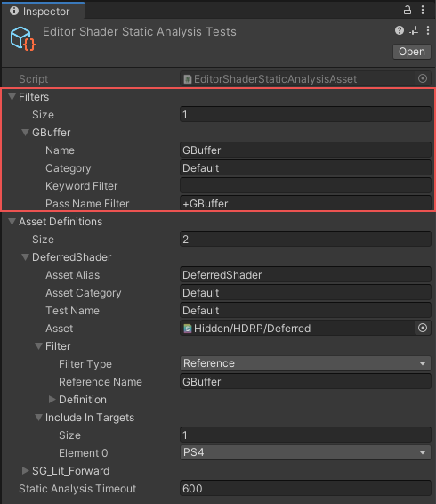

# Static Shader Analysis
The **Static Shader Analysis** asset analyzes compiled shader byte code. This analysis is per GPU program, per shader variant, and platform-specific. By default, the Static Shader Analysis asset performs the analysis and uploads the measurements to the performance database. If you run a local analysis, the Static Shader Analysis asset doesn’t upload the measurements.

Note that this is not a regression test. If a failure occurs, this means the analysis failed to execute.

## Set up 

Before you use Static Shader Analysis, make sure you have all the packages required for testing on your chosen platform:

1. Download the packages for each platform you intend to analyze for.
2. Add all of the packages from [Scriptable Render Pipeline extension packages](https://github.cds.internal.unity3d.com/unity/com.unity.render-pipelines.nda) to your manifest.

## Defining static shader analysis
You can define Static Shader Analysis in the **Static Analysis Tests** asset.

### Shared filters

A shared filter is a convenient way to reuse one or more filters across multiple asset definitions. Define a shared filter in the Static Analysis Tests asset’s **Filters** section.

| Property             | Description                                                  |
| -------------------- | ------------------------------------------------------------ |
| **Name**             | Use this field to name the filter. You can then use this name to reference this filter from the asset definition of the same name. |
| **Category**         | [Use this field to define the category this filter is in. You can create a new category or use the name of an existing category. For more information, see](https://docs.google.com/document/d/1LEU9hsXGabyV38Y7PW45YZ7_PAawox7iBcuL72SkVmU/edit#heading=h.1naa96lgrkyu) [Test classification](https://docs.google.com/document/d/1LEU9hsXGabyV38Y7PW45YZ7_PAawox7iBcuL72SkVmU/edit#heading=h.1naa96lgrkyu). |
| **Keyword filter**   | Use this field to define which keywords you want to filter into or out of your analysis results. For example, `A&B`. A more complex example:`A&B&C|A&B&D|E` |
| **Pass Name Filter** | Use this field to define which pass names you want to filter into or out of your analysis results. Use **+** to include a pass name, or - to exclude a pass name. For example: - **+GBuffer** analyzes only the GBuffer pass - **\-META,Shadow** analyzes all passes except META and Shadow. |

## Asset definitions

**Asset Definitions** defines a test involving an asset, such as a shader or material, in the **Static Analysis Tests** asset. Give each property in the **Asset Definitions** section a value.

| Property               |                    | Description                                                  |
| ---------------------- | ------------------ | ------------------------------------------------------------ |
| **Asset Alias**        |                    | An alias for the asset. Use it to filter the reported metric. |
| **Asset Category**     |                    | The category for the asset. Use it to filter the reported metric. |
| **Test Name**          |                    | The name of the test. Use it to filter the reported metric.  |
| **Filter**             |                    | This filter selects the [shader passes](##shared-filters) and which variant to analyse. |
|                        | **Filter Type**    | The type of the filter.                                      |
|                        | **Reference Name** | Enter your filter name to use the shared filter.             |
|                        | **Definition**     | Defines the filter.                                          |
| **Include in Targets** |                    | Unity performs the analysis for the selected platforms.      |
|                        | **Size**           | Defines how many platforms to include.                       |
|                        | **Element 0**      | Defines which platforms are included.                        |

## Running static shader analysis

You can run Static Shader Analysis from the [Unity Test Runner](https://docs.unity3d.com/2017.4/Documentation/Manual/testing-editortestsrunner.html).

A Static Shader Analysis entry only appears in the Test Runner for supported platforms. If an entry does not appear in the Test Runner window, this usually means you don’t have the platform package installed for your chosen platform. You need to install the platform package to use the automated static shader analysis process.