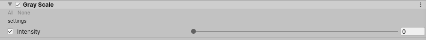

# Custom Post Process

You can write your own post processes effects directly integrated in the volume framework of HDRP. All you have to do is create a `C# Custom Post Process` and an associated FullScreen shader using the **Create** menu items.

HDRP allows you to write custom post-processing effects that will be automatically integrated with the volume system.

Let's write a very simple `grayscale` effect to show it off.

Custom effects need a minimum of two files: a C# and a HLSL source files, two menu items are available to generate a template of these files at **Create/Rendering/C# Post Process Volume** and **Create/Shader/HDRP/Post-Process**.

**Note that by default, your effect won't run if you just add it to a volume**, you need to add it to the list of supported effects in your project (it's the same list used to order the effect, see the Effect Ordering section).

## C\#

The C# volume component created from the menu will look like this:

```csharp
using UnityEngine;
using UnityEngine.Rendering;
using UnityEngine.Rendering.HighDefinition;
using System;

[Serializable, VolumeComponentMenu("Post-processing/Custom/GrayScale")]
public sealed class GrayScale : CustomPostProcessVolumeComponent, IPostProcessComponent
{
    [Tooltip("Controls the intensity of the effect.")]
    public ClampedFloatParameter intensity = new ClampedFloatParameter(0f, 0f, 1f);

    Material m_Material;

    public bool IsActive() => m_Material != null && intensity.value > 0f;

    public override CustomPostProcessInjectionPoint injectionPoint => CustomPostProcessInjectionPoint.AfterPostProcess;

    public override void Setup()
    {
        if (Shader.Find("Hidden/Shader/GrayScale") != null)
            m_Material = new Material(Shader.Find("Hidden/Shader/GrayScale"));
    }

    public override void Render(CommandBuffer cmd, HDCamera camera, RTHandle source, RTHandle destination)
    {
        if (m_Material == null)
            return;

        m_Material.SetFloat("_Intensity", intensity.value);
        m_Material.SetTexture("_InputTexture", source);
        HDUtils.DrawFullScreen(cmd, m_Material, destination);
    }

    public override void Cleanup() => CoreUtils.Destroy(m_Material);
}
```

> **Important**: this code has to be stored in a file named `GrayScale.cs`. Because of how serialization works in Unity, you have to make sure that the file is named after your settings class name or it won't be serialized properly.

<!-- Link to HDRP documentation is version dependent :/ -->
Note that both settings data and logic are stored in the same class. For your effect settings you can use all [the classes that inherit from `VolumeParameter<T>`](https://docs.unity3d.com/Packages/com.unity.render-pipelines.core@7.1/api/UnityEngine.Rendering.VolumeParameter-1.html) or create new ones yourself if you don't find a parameter that fits your needs.  
In the example above, we use a `ClampedFloatParameter` which like his name says will be clamped between the parameter of the constructor.  
Next, we have the `IsActive()` function, it will be called before the `Render` to know if the effect can be executed, it's a good practice to add all parameter configuration where your effect will do nothing. In this example, i don't want the effect to run if the intensity is 0 or we couldn't find the `GrayScale.shader`.  
`injectionPoint` override allow you to tell where your post process will be executed in the pipeline, we curretly have 3 injection points: `BeforeTransparent`, `BeforePostProcess` and `AfterPostProcess`.

Then we have the most interesting part the `Setup`, `Render` and `Cleanup` functions. These are here to respectively allocate, use and release resources that you need in your effect. In this examples we only need one material, so we create it like a standard material and we destroy it using `CoreUtils.Destroy()` in the `Cleanup`. In the `Render` function, we have access to a [CommandBuffer](https://docs.unity3d.com/2019.3/Documentation/ScriptReference/Rendering.CommandBuffer.html) that will allow you to enqueue tasks to be executed in the HD render pipeline. Here we use the `HDUtils.DrawFullScreen` that will render a fullscreen quad using the material in parameter and blit into the destination RTHandle.

## Shader

Writing custom effect shaders is fairly straightforward as well, we give you the total control over the vertex and fragment shader so you can change whatever you need. Keep in mind that there are a fairly large amount of utility functions in [Common.hlsl](https://github.com/Unity-Technologies/ScriptableRenderPipeline/blob/master/com.unity.render-pipelines.core/ShaderLibrary/Common.hlsl) and [Color.hlsl](https://github.com/Unity-Technologies/ScriptableRenderPipeline/blob/master/com.unity.render-pipelines.core/ShaderLibrary/Color.hlsl) that is included by default and you can use in your effect. For the Grayscale effect, we're going to use the Luminance() function which convert a linear RGB value to luminance.

```hlsl
Shader "Hidden/Shader/GrayScale"
{
    HLSLINCLUDE

    #pragma target 4.5
    #pragma only_renderers d3d11 ps4 xboxone vulkan metal switch

    #include "Packages/com.unity.render-pipelines.core/ShaderLibrary/Common.hlsl"
    #include "Packages/com.unity.render-pipelines.core/ShaderLibrary/Color.hlsl"
    #include "Packages/com.unity.render-pipelines.high-definition/Runtime/ShaderLibrary/ShaderVariables.hlsl"
    #include "Packages/com.unity.render-pipelines.high-definition/Runtime/PostProcessing/Shaders/FXAA.hlsl"
    #include "Packages/com.unity.render-pipelines.high-definition/Runtime/PostProcessing/Shaders/RTUpscale.hlsl"

    struct Attributes
    {
        uint vertexID : SV_VertexID;
        UNITY_VERTEX_INPUT_INSTANCE_ID
    };

    struct Varyings
    {
        float4 positionCS : SV_POSITION;
        float2 texcoord   : TEXCOORD0;
        UNITY_VERTEX_OUTPUT_STEREO
    };

    Varyings Vert(Attributes input)
    {
        Varyings output;
        UNITY_SETUP_INSTANCE_ID(input);
        UNITY_INITIALIZE_VERTEX_OUTPUT_STEREO(output);
        output.positionCS = GetFullScreenTriangleVertexPosition(input.vertexID);
        output.texcoord = GetFullScreenTriangleTexCoord(input.vertexID);
        return output;
    }

    // List of properties to control your post process effect
    float _Intensity;
    TEXTURE2D_X(_InputTexture);

    float4 CustomPostProcess(Varyings input) : SV_Target
    {
        UNITY_SETUP_STEREO_EYE_INDEX_POST_VERTEX(input);

        uint2 positionSS = input.texcoord * _ScreenSize.xy;
        float3 outColor = LOAD_TEXTURE2D_X(_InputTexture, positionSS).xyz;

        return float4(lerp(outColor, Luminance(outColor).xxx, _Intensity), 1);
    }

    ENDHLSL

    SubShader
    {
        Pass
        {
            Name "GrayScale"

            ZWrite Off
            ZTest Always
            Blend Off
            Cull Off

            HLSLPROGRAM
                #pragma fragment CustomPostProcess
                #pragma vertex Vert
            ENDHLSL
        }
    }
    Fallback Off
}
```

By default the shader template will provide you these inputs

name | description
--- | ---
positionCS | Clip space position of the pixel, between 0 and the screen size
texcoord | FullScreen UVs, between 0 and 1
_InputTexture | Is passed from the C# and will be your source texture (camera color buffer)
_Intensity | Also passed from the C# component, it is the parameter exposed in the UI

> **Look for clip() in your shaders**: don't use the clip() instruction in the shaders, it will break your effect

> **Important:** if the shader is never referenced in any of your scenes it won't get built and the effect will not work when running the game outside of the editor. Either add it to a [Resources folder](https://docs.unity3d.com/Manual/LoadingResourcesatRuntime.html) or put it in the **Always Included Shaders** list in `Edit -> Project Settings -> Graphics`.

## Effect ordering

To order your effects, go to `Edit -> Project Settings` and select the `HDRP Default Settings` section. At the bottom you'll find three lists, one for each injection points. Add your custom effects in these list so your effect will be in the list of effects that can be rendered. Upper post processes will be executed first.


Of course the order of execution will be `Before Transparent` -> `Before Post Process` -> `After Post Process` and then inside these categories, the order you defined in these list will be used.

## Custom editor

By default editors for settings classes are automatically created for you. But sometimes you'll want more control over how fields are displayed. Like classic Unity components, you have the ability to create custom editors.

> **Important:** like classic editors, you'll have to put these in an `Editor` folder.

If we were to replicate the default editor for our `Grayscale` effect, it would look like this:

```csharp
using UnityEditor.Rendering;
using UnityEngine;
using UnityEngine.Rendering.HighDefinition;
using UnityEditor;

[VolumeComponentEditor(typeof(GrayScale))]
sealed class GrayScaleEditor : VolumeComponentEditor
{
    SerializedDataParameter m_Intensity;

    public override bool hasAdvancedMode => false;

    public override void OnEnable()
    {
        base.OnEnable();

        var o = new PropertyFetcher<GrayScale>(serializedObject);

        m_Intensity = Unpack(o.Find(x => x.intensity));
    }

    public override void OnInspectorGUI()
    {
        PropertyField(m_Intensity);
    }
}
```

Of course in this case, the custom editor isn't really useful but if you want to dynamically hide settings or display some more advanced views, you'll need that. By default the volume component editor also support advanced modes, to enable but button in the UI, you just have to change the `hasAdvancedMode` from `false` to `true`. Then inside the `OnInspectorGUI` you can use `isInAdvancedMode` boolean to show advanced settings.



## TroubleShooting

If your effect isn't displayed, look for:

- **Your project settings**: check if your effect is listed under one of the post process order lists (See the Effect Ordering section).
- **The shader of your effect**: check that it compiles and that the reference to the material in your post process volume is not null due to that.
- **The volume bounds and priority**: check that the volume that contains your post processes is not overwritten by another one and that the bounds are correctly setup.

<!-- 
## Example 1

TODO -->
