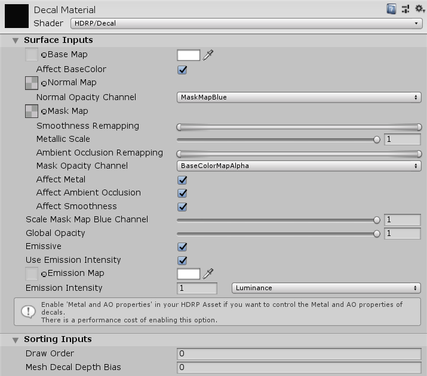

# Decal Shader

The High Definition Render Pipeline (HDRP) includes the [Decal Projector](Decal-Projector.html) component, which you can use to project specific Materials into your Scene to create realistic-looking decals. These Materials must use the **HDRP/Decal** Shader. Use the Shader properties to customize your decals.

## Properties

 

### Surface Inputs

These properties allow you to set the inputs that affect the behavior of the decal when HDRP renders it into the Scene.

| **Property**                    | **Description**                                              |
| ------------------------------- | ------------------------------------------------------------ |
| **Base Map**                    | Allows you to specify a Texture for the decal as well as modify the decal’s base color. |
| **Affect BaseColor**            | Defines whether the decal uses the alpha channel of the base color as an opacity for its other properties without modifying the base color of the Material the decal projects on. |
| **Normal Map**                  | A map that modifies the normal property of the Material the decal projects onto. |
| **Normal Opacity channel**      | Controls the source of normal map opacity. You can select either **Base Color Alpha** or **Mask Map Blue**: **Base Color Alpha** uses the alpha channel of the **Base Map**’s color picker as opacity. **Mask Map Blue** uses the blue channel of the **Mask Map** as opacity. |
| **Mask Map**                    | Defines a map that packs the following Material maps into each of its RGBA channels. Red channel: Metallic map. Green channel: Ambient occlusion map. Blue channel: Opacity map. Alpha channel: Smoothness map. |
| **Smoothness Remapping**        | Remaps the smoothness values from the **Mask Map** to the range you specify. Rather than [clamping](https://docs.unity3d.com/ScriptReference/Mathf.Clamp.html) values to the new range, it condenses the original range down to the new range uniformly. |
| **Metallic**                    | The strength of the metallic effect of the decal. This targets the values of the Metallic map in the Red channel of the **Mask Map**. Choose a value from 0 and 1 where 0 means no effect and 1 means full effect. |
| **AO Remapping**                | Remaps the ambient occlusion values from the **Mask Map** to the range you specify. Rather than [clamping](https://docs.unity3d.com/ScriptReference/Mathf.Clamp.html) values to the new range, it condenses the original range down to the new range uniformly. |
| **Mask Opacity channel**        | Controls the source of the **Mask Map** opacity. You can select either **Base Color Alpha** or **Mask Map Blue**. **Base Color Alpha** uses the alpha channel of the **Base Map**’s color picker as opacity. **Mask Map Blue** uses the blue channel of the **Mask Map** as opacity. |
| **Affect Metal**                | Enable this checkbox to make the decal use the metallic property of its **Mask Map**. Otherwise the decal has no metallic effect. Uses the red channel of the **Mask Map**. |
| **Affect AO**                   | Enable this checkbox to make the decal use the ambient occlusion property of its **Mask Map**. Otherwise the decal has no ambient occlusion effect. Uses the green channel of the **Mask Map**. |
| **Affect Smoothness**           | Enable this checkbox to make the decal use the smoothness property of its **Mask Map**. Otherwise the decal has no smoothness effect. Uses the alpha channel of the **Mask Map**. |
| **Scale Mask Map Blue Channel** | A multiplier for the opacity (blue channel of the **Mask Map**). A value of 0 means no effect and a value of 1 means full effect. |
| **Global Opacity**              | Defines the opacity of the decal. The lower the value, the more transparent the decal. |

**Note:** To alter the **Affect Metal**, **Affect AO**, and **Affect Smoothness** properties, you must enable the **Metal and AO properties** in your Unity Project’s [HDRP Asset](HDRP-Asset.html). Navigate to **HDRP Asset** > **Decals** and tick the **Metal and AO properties** checkbox. Otherwise, the decal only affects smoothness.

### Sorting Inputs

These properties allow you to change the rendering behavior of the decal.

| **Property**              | **Description**                                              |
| ------------------------- | ------------------------------------------------------------ |
| **Draw order**            | Controls the order in which HDRP draws decals in the Scene. HDRP draws decals with lower values first, so it draws decals with a higher draw order value on top of those with lower values. This feature works for decals projected on opaque and transparent surfaces. |
| **Mesh decal depth bias** | A depth bias that HDRP applies to the decal’s Mesh to stop it from overlapping with other Meshes. A negative value draws the decal in front of any overlapping Mesh, while a positive value offsets the decal and draw it behind. This property only affects decal Materials directly attached to GameObjects with a Mesh Renderer, so Decal Projectors do not use this property. |

### HDRP Asset properties

You can edit global settings that apply to all decals in your Scene in your Unity Project’s HDRP Asset. For information on these properties, see the (**Decals** section of the HDRP Asset documentation](HDRP-Asset#Decals).