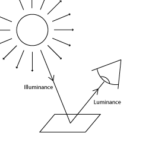

# High Definition Render Pipeline Glossary

## General terms

#### atmospheric scattering
Atmospheric scattering is the phenomena that occurs when particles suspended in the atmosphere diffuse (or scatter) a portion of the light, passing through them, in all directions.

#### channel packing
A channel packed Texture is a Texture which has a separate grayscale image in each of its channels.

#### Nyquist rate:
The minimum rate at which you can sample a real-world signal without introducing errors. This is equal to double the highest frequency of the real-world signal.

#### ray marching:
An iterative ray intersection test where your ray marches back and forth until it finds the intersection or, in a more general case, solves the problem you define for it.

#### texture atlas:

A texture atlas is a large texture containing several smaller textures packed together. HDRP uses texture atlases for shadow maps and decals.

### Aliasing and anti-aliasing terms

#### aliasing:
Describes a distortion between a real-world signal and a digital reconstruction of a sample of a signal and the original signal itself.

#### fast approximate anti-aliasing (FXAA):
An anti-aliasing technique that smooths edges on a per-pixel level. It is not as resource intensive as other techniques.

#### spatial aliasing
Refers to aliasing in digital samples of visual signals.

#### temporal anti-aliasing (TAA):
An anti-aliasing technique that uses frames from a history buffer to smooth edges more effectively than fast approximate anti-aliasing. It is substantially better at smoothing edges in motion but requires motion vectors to do so.

## Lighting terms

#### illuminance:

A measure of the amount of light ([luminous flux](#LuminousFlux)) falling onto a given area. Differs from luminance because illuminance is a specific measurement of light whereas luminance describes visual perceptions of light.

#### luminous flux:
A measure of the total amount of visible light a light source emits.

#### luminous intensity:
A measure of visible light as perceived by human eyes. It describes the brightness of a beam of light in a specific direction. The human eye has different sensitivities to light of different wavelengths, so luminous intensity weights each different wavelength contribution by the standard [luminosity function](#LuminosityFunction).

#### luminosity function:
A function that describes a wave that represents the human eye’s relative sensitivity to light of different wavelengths. This wave corresponds weight values, between 0 and 1 on the vertical axis, to different wavelengths, on the horizontal axis. For example, the standard luminosity function peaks, with a weight of 1, at a wavelength of 555 nanometers and decreases symmetrically with distance from this value.

#### punctual lights: 
A light is considered to be punctual if it emits light from a single point. HDRPs Spot and Point Lights are punctual.

