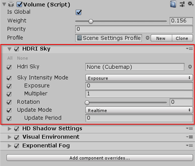

# HDRI Sky

The **HDRI Sky Volume** component override controls settings you can use to set up an HDRI Sky. An HDRI Sky is a simple sky representation that uses a cubemap texture. This component also enables you to define how HDRP updates the indirect lighting the sky generates in the Scene.

Tip: [Unity HDRI Pack](https://assetstore.unity.com/packages/essentials/beta-projects/unity-hdri-pack-72511) is available on the Unity Asset Store and provides 7 pre-converted (1024×2014 resolution) HDR Cubemaps ready for use within your Project.

To use this type of sky. You must first add it to a Volume and set that Volume’s **Visual Environment** component override’s **Sky Type** to **HDRI Sky.** For details on how to do this, see the [Visual Environment](Visual-Environment.html) documentation.

| Property                           | Description                                                  |
| ---------------------------------- | ------------------------------------------------------------ |
| **HDRI Sky**                       | Sets the cubemap HDRP uses to render the sky.                |
| **Sky Intensity Mode**             | Specifies how HDRP calculates the intensity of the environment light it applies to the Scene. |
| - **Exposure**                     | Defines the sky intensity using the **Exposure** and **Multiplier** properties. |
| - - **Exposure**                   | Sets the amount of light per unit area that HDRP applies to the HDRI Sky cubemap. |
| - - **Multiplier**                 | Multiplies the exposure that HDRP applies to the **HDRI Sky** cubemap. |
| - **Lux**                          | Define the sky intensity in terms of Lux values.             |
| - - **Desired Lux Value**          | Sets an absolute intensity for the HDR texture you set in **HDRI Sky**, in Lux, for lighting received in a direction perpendicular to the ground. This is similar to the Lux unit you use to represent the Sun and thus is complimentary. |
| - - **Upper Hemisphere Lux Value** | Displays the relative intensity, in Lux, for the current HDR texture set in **HDRI Sky**. The final multiplier HDRP applies for intensity is **Desired Lux Value** / **Upper Hemisphere Lux Value**. This field is an informative helper. |
| **Rotation**                       | Makes HDRP rotate the cubemap by this angle in degrees.      |
| **Update Mode**                    | Controls the rate at which HDRP updates the sky environment (using Ambient and Reflection Probes). |
| - **On Changed**                   | Makes HDRP update the sky environment when one of its properties change. |
| - **On Demand**                    | Makes HDRP wait until you manually call for a sky environment update via a script. |
| - **Realtime**                     | Makes HDRP update the sky environment at regular intervals defined by the **Update Period**. |
| - - **Update Period**              | Set the period (in seconds) at which HDRP updates the sky environment when you set the **Update Mode** to **Realtime**. Set the value to 0 if you want HDRP to update the sky environment every frame. |