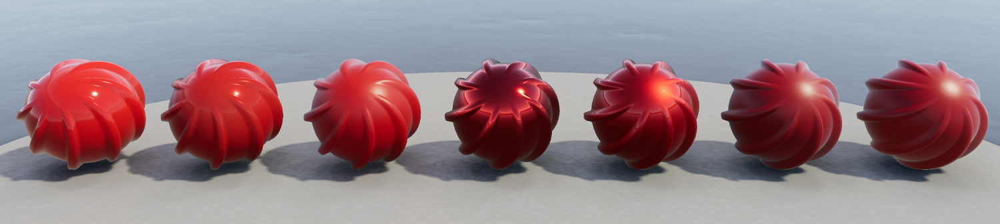
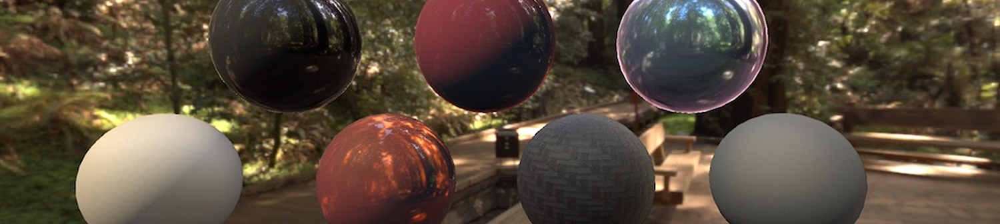
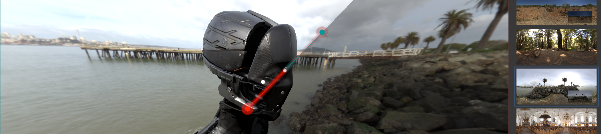

# High Definition Render Pipeline overview

This is a high level overview of all of the features you can use in the High Definition Render Pipeline (HDRP). This document presents the features in the following categories:

- [Project](#Project)
- [Material](#Material)
- [Lighting](#Lighting)
- [Camera](#Camera)
- [Tools](#Tools)
- [Programming](#Programming)

## Project

### Platform support

You can run HDRP Projects on Xbox One, PS4, and compute Shader compatible devices for DirectX 11, DirectX 12, Metal, and Vulkan.

### Virtual Reality

HDRP is compatible with VR and optimized for single-pass rendering. For more information about Virtual Reality, see the [VR documentation](VR-Overview.md).

### Camera-relative rendering

Use HDRP to render distance GameObjects with large world-space coordinates in a more robust and numerically stable way than the built-in render pipeline. For information on how HDRP achieves this, see the [Camera-relative rendering documentation](Camera-Relative-Rendering.md).

### Dynamic resolution

When you use dynamic resolution, HDRP can render at varying resolutions. To do this, it either uses hardware features, if available, or renders to render targets that are equal size or smaller than the current viewport. This helps maintain a stable frame rate in your Unity Project. For more information on dynamic resolution, as well as the types that HDRP supports, see the [dynamic resolution documentation](Dynamic-Resolution.md).

### Volumes

Use Volumes to localize environmental Scene settings and post-processing effects. You can have multiple Volumes inside a Scene, and make effects like fog density, sky color, or exposure depend on the position of the Camera. For information on how to use Volumes in HDRP, see the [Volumes documentation](Volumes.md).

## Materials

HDRP Shaders allow you to use the following features:

- [Opaque/transparent surfaces](Surface-Type.md).
  - Different blend modes for transparent surfaces.
  - Transparent surfaces that work with fog.
  - Refraction and distortion for transparent surfaces.

- [Material types](Material-Type.md).

  - Anisotropy, for surfaces that have highlights that change when you view them from different angles, like brushed metal or velvet.
  - Iridescence, for surfaces that appear to change color as you view them from different angles, like soap bubbles or insect wings.
  - Metallic, for surfaces only lit by specular lighting and take the base color input for specular color. For example, aluminum, copper, and steel.
  - Specular Color, for surfaces that you want to have a colored specular highlight.
  - Subsurface Scattering, for translucent surfaces that simulate light interaction and scattering, like skin or plant leaves.
  - Translucent, for surfaces that simulate light interaction, but do not blur light that transmits through the Material.

- Pixel and vertex displacement, for surfaces that you want to displace based on a height map.

- Emission, for Materials that you want to act as a self-illuminating light source.

- [Decals](Decal-Shader.md), for surfaces that you want to project a Texture onto.

- Detail mapping, for surfaces that you want to add micro details to.

### Lit Shader

Use the Lit Shader to easily create realistic Materials and includes options for effects including subsurface scattering, iridescence, and translucency. This is the default Shader in HDRP. For more information, including the full list of Shader properties, see the [Lit Shader documentation](Lit-Shader.md).

### Layered Lit Shader

The Layered Lit Shader combines a main Material with other tileable Materials in order to produce visuals with a similar quality to a single high-resolution texture, but at a lower performance cost than a [Lit Shader](Lit-Shader.md) using the single high-resolution Texture. For more information, including a full list of Shader properties, see the [Layered Lit Shader documentation](Layered-Lit-Shader.md).

### Unlit Shader

The Unlit Shader allows you to create Materials that are not affected by lighting. Unlit Shaders are perfect for visual effects. For more information, including a full list of Shader properties, see the [Unlit Shader documentation](Unlit-Shader.md).

With the **Shadow Matte** option in the settings, we can have the surface receive shadow without lighting. We have Opaque or Transparent shadow with alpha for each of them.

### StackLit Shader

The StackLit Shader improves on the Lit Shader in favor of quality over performance. This Shader coats surfaces more accurately than the Lit Shader, and, unlike the Lit Shader, allows you to use multiple Material features like anisotropy, subsurface scattering iridescence, and hazy parametrization at the same time.

### Hair Shader

The Hair Shader is purpose-built to accurately render realistic hair in your Unity Project. It uses an improved Kajiya Kay lighting model which features better energy conservation and provides you with more flexibility. For more information, including a full list of Shader properties, see the [Hair Shader](hair-shader.md) and [Hair Master Stack](master-stack-hair.md) documentation.

### Fabric Shader

The Fabric Shader allows you to render realistic fabric Materials in HDRP. You can use the cotton wool or silk lighting model to create a wide variety of fabrics. For more information, including a full list of Shader properties, see the [Cotton/Wool Shader](cotton-wool-shader.md), [Silk Shader](silk-shader.md), and [Fabric Master Stack](master-stack-fabric.md) documentation.

### AxF Shader

The AxF Shader supports the [X-Rite AxF](https://www.xrite.com/axf) measured Material format. The AxF importer, available in [Unity Enterprise for Product Lifecylce](https://unity.com/products/unity-enterprise-product-lifecycle), automatically populates an AxF Material when it imports AxF Assets. For more information, including a full list of Shader properties, see the [AxF Shader documentation](AxF-Shader.md).

### Decals

HDRP allows you to apply decals to surfaces in your Scene. To apply a decal to a surface, you can either use the [Decal Projector component](Decal-Projector.md) to project the decal onto the surface, or assign the decal shader directly to a Mesh and then place the Mesh on the surface. For more information, see the [Decal documentation](Decal.md).

HDRP also supports Decal Layers which allows you to control which GameObjects receive decals or not. 

### Terrain Shader

The Terrain Lit Shader is compatible with the built-in terrain system and supports up to eight layers in a single draw call. This Shader uses the same lighting model as the Lit Shader. For more information, including the full list of Shader properties, see the [Terrain Lit Shader documentation](Terrain-Lit-Shader.md).

## Lighting

### Light types

The HDRP light types use [physical light units](#PLU) to help you light your Scene in the most realistic way possible. To assist you in creating physically-accurate lights, the [Light component](Light-Component.md) Inspector includes icons alongside the **Intensity** and **Temperature** properties. Each icon displays the real-world light source that the value of each property currently represents. Each icon is also a button which you can click to access a list of preset values that match real-world light sources. For lights to behave properly when using PLU, you need to respect HDRP unit convention (1 Unity unit equals 1 meter). The HDRP light types are:

- **Directional**
  - Color temperature
  - Colored cookie
  - [Shadowmask](Lighting-Mode-Shadowmask.md) support

- **Spot**
  - Color temperature
  - Colored cookie
  - [Shadowmask](Lighting-Mode-Shadowmask.md) support
  - Cone, pyramid and box shapes

- **Point**
  - Color temperature
  - Colored cookie
  - [Shadowmask](Lighting-Mode-Shadowmask.md) support

- **Rectangle**
  - Color temperature
  - Colored Cookie
  - [Shadowmask](Lighting-Mode-Shadowmask.md) support

- **Tube**
  - Color temperature
  - No [Shadowmask](Lighting-Mode-Shadowmask.md) support

- **Disk (Baked only)**
  - Color temperature
  - No [Shadowmask](Lighting-Mode-Shadowmask.md) support

For more information, including the full list of light properties, see the [Light component documentation](Light-Component.md).

### IES Profiles and light cookies

HDRP supports the Illuminating Engineering Society's (IES) file format for describing the distribution of light from a light source. HDRP supports the IES profile for Point, Spot (Cone, Pyramid, and Box), and rectangular Area [Lights](Light-Component.md). You can also mix the IES profile with [cookies](https://docs.unity3d.com/Manual/Cookies.html) and even use the profile and cookie mix for [light map baking](https://docs.unity3d.com/Manual/LightMode-Baked.html).

### Reflection probes

HDRP supports cubemap reflections that take surface smoothness into account. HDRP cubemap reflection optionaly support a fake distance based roughness. This helps you produce realistic reflections in your Scene in real time.  For more information, see the [introduction to Reflection Probes](Reflection-Probes-Intro.md)

### Planar reflection probe

HDRP supports Planar reflection probes that take surface smoothness into account. This allows you to to create effects that mimic a shiny mirror or a wet floor. HDRP includes accurate filtering for planar reflection that is close to being physically-based.

For more information, see [Planar Reflection Probe](Planar-Reflection-Probe.md).

### Screen-space reflection and refraction

HDRP provides a screen-space solution for reflection and refraction. It uses the depth and color buffer of the screen to help simulate the path that light travels to the Camera and uses this to calculate accurate reflection and refraction. You can use this feature for transparent materials too, such as windows or water. For more information, see the [screen-space reflection](Reflection-in-HDRP.md#ScreenSpaceReflection) and [screen-space refraction](Refraction-in-HDRP.md#ScreenSpaceRefraction) documentation.

### Screen-space global illumination

HDRP supports screen-space global illumination (SSGI). SSGI is an algorithm that accesses the indirect diffuse lighting that the environment generates. It works in the same way as the [Screen Space Reflection](Override-Screen-Space-Reflection.md) in that it uses ray marching to calculate the result.

### Screen-space distortion

HDRP provides a screen-space solution for distortion. Distortion is similar to refraction except that it is purely artistic driven. For more information, see the [distortion](Surface-Type.md#TransparencyInputs) documentation.

### Exposure

HDRP allows you to calculate exposure using several methods. This includes: 

##### Histogram exposure

HDRP's exposure implementation computes a histogram of the image which allows you to select high and low percentile values to discard. Discarding outlying values in the shadows or highlights helps to calculate a more stable exposure.

For more information, see [Exposure](Override-Exposure.md).

##### Metering mode

HDRP's exposure implementation includes a metering mask. This includes a texture-based mask and a procedural mode.

For more information, see [Exposure](Override-Exposure.md).

### Emission

HDRP Materials support light [emission](Lit-Shader.md#EmissionInputs), which allows you to make a Material into a self-illuminated visible source of light. Global illumination takes emission into account and you can use [physical light units](#PLU) to set the intensity based on real-world lights. 

### Shadows

HDRP uses multiple methods to calculate shadows:

- [Shadow cascades](Override-Shadows.md): HDRP uses cascade splits to control the quality of shadows cast by Directional Lights based on the distance from the Camera.
- [Contact Shadows](Override-Contact-Shadows.md): HDRP [raymarches](Glossary.md#RayMarching) inside the depth buffer to process these shadows. That way, HDRP captures small details that regular shadow algorithms fail to capture.
- [Micro Shadows](Override-Micro-Shadows.md): HDRP uses the normal map and ambient occlusion map of a Material to estimate the shadows that those maps would cast if they were Meshes.

To decrease aliasing for the main cascade shadow maps, you can apply different filters to them, like PCF or PCSS.

For punctual and area light shadows, HDRP allows for dynamic resolution based on how much screen the light covers. HDRP rescales the content of the shadow atlas when it would be otherwise full.  For more information on the filtering algorithms that HDRP uses, see the [filtering qualities documentation](HDRP-Asset.md#filtering-qualities).

In the advanced settings of the shadow maps, there is also the possibility to apply a tint on the shadow or the penumbra of the shadow.

### Sky 

 

In HDRP, you set up the sky inside a [Volume](Volumes.md), so you can change sky settings, or even the type of sky itself, depending on the position of the Camera in the Scene. HDRP allows you to separate the visual sky from the sky that you use for environment lighting. HDRP includes the following built-in sky types for you to use in your Unity Project:

- [Gradient Sky](Override-Gradient-Sky.md): Renders a simple sky with three color zones for the top, middle, and bottom sections of the sky.
- [HDRI Sky](Override-HDRI-Sky.md): Constructs a sky environment based on a cubemap texture you set within the HDRI Volume component.
- [Physically Based Sky](Override-Physically-Based-Sky.md): Simulates a spherical planet with a two-part atmosphere which features exponentially decreasing density with respect to altitude.
- [Procedural Sky](Override-Procedural-Sky.md): Produces an environment based on the values you choose within the Procedural Sky Volume component. This is similar to Unity’s [built-in render pipeline procedural sky](https://docs.unity3d.com/Manual/class-Skybox). This sky type has been deprecated, but you can still use it in your HDRP Project. For information on how, see [Upgrading to 2019.3](Upgrading-from-2019.2-to-2019.3.md).

HDRP is able to handle multiple skies seen by different Cameras.

### Fog

In HDRP, you set up fog, inside a [Volume](Volumes.md), so you can change fog settings, or even the fog type itself, depending on the position of the Camera in the Scene. You can set the color of the fog yourself or use the color of the sky. HDRP fog affects Materials with both opaque and transparent surfaces. HDRP implements an exponential [fog](Override-Fog.md) with optional volumetric effects.

### Light Layers 

Light Layers are LayerMasks that you specify for Lights and Meshes. Lights only illuminate Meshes that are on Light Layers that you enable on the Light. You can also use Light Layers in the shadow map settings to decouple shadows from lighting. For more information on Light Layers, see the [Light Layers documentation](Light-Layers.md).  

Light layers In the shadow map dropdown can also be used to control which object receives a shadow from which light. By default both Light Layers and Shadow Map Light Layers are synchronized so the result is coherent (When an object receives light it also casts shadows). For more information on Shadow Map Light Layers, see the [Shadow Light Layer section](Light-Layers.md#ShadowLightLayers)

### Screen space ambient occlusion 

HDRP includes a [screen space ambient occlusion](Override-Ambient-Occlusion.md) effect that approximates ambient occlusion in real time. It approximates the intensity and position of ambient light on a GameObject’s surface, based on the light in the Scene and the environment around the GameObject.

### Screen space specular occlusion

HDRP also provides an extension to the screen space ambient occlusion effect which supports directional information. HDRP applies this directly to indirect specular lighting.

### Physical light units

HDRP uses real-world physical light units, so you can easily light your Scene in a realistic way. For more information on physical light units, including a list of which units HDRP uses, see the [physical light units documentation](Physical-Light-Units.md).

When using physical light unit, the intensity of lights can be really high and cause precision issue and clamping of highlight.
To counteract this effect **HDRP use pre-exposure**. Pre-exposure apply the camera exposition from the previous frame before storing the lighting information.

### Ray tracing (Preview)

HDRP uses ray tracing to replace some of its screen space effects, shadowing techniques, and Mesh rendering techniques.
Real time raytracing effect are currently in Preview and behavior could change in the future.

- [Ray-Traced Ambient Occlusion](Ray-Traced-Ambient-Occlusion.md) replaces [screen space ambient occlusion](Override-Ambient-Occlusion.md) with a more accurate, ray-traced, ambient occlusion technique that can use off screen data.
- [Ray-Traced Contact Shadows](Ray-Traced-Contact-Shadows.md) replaces [contact shadows](Override-Contact-Shadows.md) with a more accurate, ray-traced, contact shadow technique that can use off screen data.
- [Ray-Traced Global Illumination](Ray-Traced-Global-Illumination.md) is an alternative to Light Probes and lightmaps in HDRP.
- [Ray-Traced Reflections](Ray-Traced-Reflections.md) is a replacement for [screen space reflection](Override-Screen-Space-Reflection.md) that uses a ray-traced reflection technique that can use off-screen data.
- [Ray-Traced Shadows](Ray-Traced-Shadows.md) replace shadow maps for Directional, Point, and Area [Lights](Light-Component.md).
- [Recursive Ray Tracing](Ray-Tracing-Recursive-Rendering.md) replaces the rendering pipeline for Meshes. Meshes that use this feature cast refraction and reflection rays recursively.
- [Ray-Traced Subsurface Scattering](Ray-Traced-Subsurface-Scattering.md) is an alternative to [Subsurface-Scattering](Subsurface-Scattering.md) that can make use of off-screen data.

## Camera

### Post-processing

HDRP includes its own purpose-built implementation for post-processing to produce exceptionally high-quality graphics. You can use post-processing to apply full-screen filters and effects to the Camera to drastically improve the visuals of your Unity Project with little set-up time. For an overview on HDRP post-processing, see the [post-processing documentation](Post-Processing-Main.md).

### Accumulation motion blur 

HDRP includes a recording API which you can use to render effects such as high-quality accumulation motion blur. This technique creates the final "converged" frame by combining information from multiple intermediate sub-frames. This API allows your scripts to extract the properly converged final frames and perform further processing or save them to disk.

For information about this feature, and for some example scripts, see [Multiframe rendering and accumulation](Accumulation.md).

### Anti-Aliasing

 

HDRP includes the following [anti-aliasing](Anti-Aliasing.md) methods to help you remove aliasing effects with performance and quality in mind:

- [Multisample anti-aliasing](Anti-Aliasing.md#MSAA)(MSAA): Samples multiple locations within every pixel and combines these samples to produce the final pixel. You can use an alpha to mask out an area to use MSAA. This is the most resource intensive anti-aliasing technique in HDRP. 
- [Temporal anti-aliasing](Anti-Aliasing.md#TAA)(TAA): Uses frames from a history buffer to smooth edges more effectively than fast approximate anti-aliasing. It is substantially better at smoothing edges in motion, but you must enable motion vectors for this.
- [Subpixel morphological anti-aliasing](Anti-Aliasing.md#SMAA)(SMAA): Finds patterns in borders of the image and blends the pixels on these borders according to the pattern.
- [Fast approximate anti-aliasing](Anti-Aliasing.md#FXAA)(FXAA): Smooths edges on a per-pixel level. This is the least resource intensive anti-aliasing technique in HDRP.

### Physical Camera

HDRP uses a physically-based Camera system that works seamlessly with the other physical features of HDRP, such as [physical light units](#PLU), to produce physically-accurate, unified results. A physically-based camera works like a real-world camera, and therefore uses the same properties. This allows you to configure an HDRP Camera to mimic the behavior of a real-world camera, with expected results for effects such as exposure and depth of field. For more information on HDRP's physically-based camera, includings a description of how to use it, see the [Camera component documentation](HDRP-Camera.md).

### Custom Post-processing

HDRP allows you to add your own custom post processes integrated with the volume framework. They can be injected after opaque and sky object, before the [temporal anti-aliasing](Anti-Aliasing.md#TAA) pass, before builtin post processes or after builtin post processes. For more information, see the [Custom Post-processing documentation](Custom-Post-Process.md).

### Custom Passes

Custom Passes allow you to inject shader and C# at certain points inside the render loop, giving you the ability to draw objects, do fullscreen passes and read some camera buffers like depth, color or normal, see the [Custom Pass documentation](Custom-Pass.md).

The Custom Pass API allows you to render GameObjects from another point of view, like a disabled camera, within the rendering of your main Camera. This API also comes with built-in support for rendering Depth, Normal and Tangent into an RTHandle.

You can also use this Camera override to render some GameObjects with a different field of view, like arms in a first-person application.

### Custom Pass AOV Export

This feature allows you to export arbitrary data from custom pass injection points using an extension of the Arbitrary Output Variables (AOV) API in HDRP. An example use-case is for exporting “Object IDs” that are rendered with a custom pass. For information about the feature and example scripts, see the [AOV documentation](AOVs.md).

### Path tracing

#### Path-traced depth of field

HDRP includes a depth of field mode for producing path-traced images with high-quality defocus blur. Compared to post-processed depth of field, this mode works with multiple layers of transparency and does not produce any artifacts, apart from noise typical in path traced images. You can fix this by increasing the sample count and/or using an external denoising tool.

For more information about this feature, see [Depth-of-field](Post-Processing-Depth-of-Field.md).

#### Path tracer convergence

HDRP includes a recording API which you can use to render converged path-traced images. This technique creates the final "converged" frame by combining information from multiple intermediate sub-frames. This API allows your scripts to extract the properly converged final frames and perform further processing or save them to disk.

#### Path-traced sub-surface scattering

Path tracing supports subsurface scattering (SSS), using a random walk approach. To use it, enable path tracing and set up SSS in the same way as you would for HDRP materials.

For information on SSS in HDRP, see [subsurface scattering](Subsurface-Scattering.md).

#### Path-traced fog

Path tracing now supports fog absorption. Like SSS, to use this feature, enable path tracing and set up fog in the same way as you would for standard fog in HDRP.

For information on fog in HDRP, see [fog](Override-Fog.md).

## Tools

### Render Pipeline Wizard

To help you set up HDRP quickly and correctly, HDRP provides the Render Pipeline Wizard. Use the wizard to fix configuration issues with a single button click, and create a template Scene that is already configured with default Scene settings. For more information on the Render Pipeline Wizard, including a description of how to use it, see the [Render Pipeline Wizard documentation](Render-Pipeline-Wizard.md).

### Render Pipeline Debugger

The Render Pipeline Debugger contains many debugging and visualization tools to help you to understand and solve any issues quickly. For more information on the Render Pipeline Debugger, including a description of how to use it, see the [Render Pipeline Debugger documentation](Render-Pipeline-Debug-Window.md).

### LookDev

The LookDev is a viewer that allows you to import and display Assets in a good, consistent lighting environment. Use it to validate outsourced Assets or to showcase your own created Asset with HDRP. For more information on the LookDev, including a description of how to use it, see the [LookDev documentation](Look-Dev.md).

### Debug modes

HDRP includes debug modes that to help you debug your assets, your lighting, and your scene.

#### Lighting debug view

To help you to debug lighting in your Scene, HDRP includes various lighting debug view modes that allow you to separate the various components of the light into multiple parts. These debug modes are also available in the [AOV](AOVs.md) API to allow recorders to export them:

- Diffuse
- Specular
- Direct diffuse
- Direct specular
- Indirect diffuse
- Reflection
- Refraction

#### Light layer debug mode

HDRP includes a [light layer](Light-Layers.md) debug mode that displays the light layers assigned to each GameObject or highlights GameObjects that match the light layers of a specific Light.

For more information, see the Lighting panel section in the [HDRP debug window](Render-Pipeline-Debug-Window.md).

#### Volume debug mode

The Render Pipeline Debug window has a Volume panel which you can use to visualize the Volume components that affect a specific Camera. 

For each Volume that contributes to the final interpolated value, the Volume panel shows the value of each property and whether or not it is overridden. It also calculates the Volume's influence percentage using the Volume's weight and blend distance. 

For more information, see the Volume panel section in the [HDRP debug window](Render-Pipeline-Debug-Window.md#VolumePanel).

#### Quad Overdraw and Vertex Density

This debug tool is made of two parts:

- Quad Overdraw: This highlights GPU quads running multiple fragment shaders caused by small or thin triangles.
- Vertex Density: This displays pixels running multiple vertex shaders.

This is useful for Meshes that are far away or highly detailed. This debug tool can help you find GameObjects in your scene that may require LODs. This mode is not currently supported on Metal.

### MatCap mode

In MatCap mode, HDRP replaces the functionality of the Scene window's Lighting button with a material capture (MatCap.md) view. This mode is particularly useful to navigate and get a sense of the Scene without setting up the Scene lighting. For more information on the MatCap mode, including a description of how to use it, see [MatCap mode](MatCap.md)

### Backplate

From the [HDRI Sky](Override-HDRI-Sky.md), you can directly project the bottom part onto a plane with various shapes such as a Rectangle, Circle, Ellipse, or Infinite plane.  
To match the scale of the GameObjects in your Scene, you can vary the pixel footprint.

### Light Explorer

The Light Explorer allows you to select and edit light sources: Directional lights, Point lights, Spot lights, Area lights, Reflection Probes, Planar Probes and Sky and Fog volumes

### Graphics Compositor

The Graphics Compositor allows real-time compositing operations between layers of 3D content, static images, and videos.

This tool support three types of compositing techniques:

- Graph-based compositions guided by Shader Graph.
- Camera stacking compositions: Multiple cameras render to the same render target and the result can then be used in graph-based composition.
- 3D composition: Insert composition layers into a 3D Scene to create effects like reflections/refractions between composited layers on a 3D GameObject.

Overall, this tool allows you to compose a final frame by mixing images and videos with 3D content in real-time inside Unity, without the need of an external compositing tool.

For information about the feature, see the [HDRP Compositor documentation](Compositor-Main.md).

## Programming

### Material architecture

HDRP supports forward and deferred Materials. Deferred Materials are more efficient than Forward Materials, but support a slightly limited set of properties. Forward Material have no property limitations, but are slower to render than Deferred Materials.

HDRP's Material architecture allows you to add your own forward Materials and includes a list of rules you must follow to compile your Material in HDRP.

### Lighting architecture

HDRP uses a hybrid tile and cluster renderer for [forward and deferred rendering](Forward-And-Deferred-Rendering.md) of opaque and transparent GameObjects. This creates a local light list to allow HDRP to render a high number of Lights. Use the forward renderer to light more complex Materials, such as those that use subsurface scattering or are anisotropic. Use the deferred renderer to increase the processing speed of lighting for common Materials, such as standard Lit or Unlit Materials. For more information on HDRP's lighting architecture, including an explanation of tile and cluster rendering, see the [lighting pipeline documentation](https://docs.unity3d.com/Manual/BestPracticeLightingPipelines).

### Control on Shadow Update

HDRP provides an API to ask a light to update their shadow maps. All you have to do is set the shadow map update mode to OnDemand and call `RequestShadowMapRendering()` in the `RequestShadowMapRendering` class.
