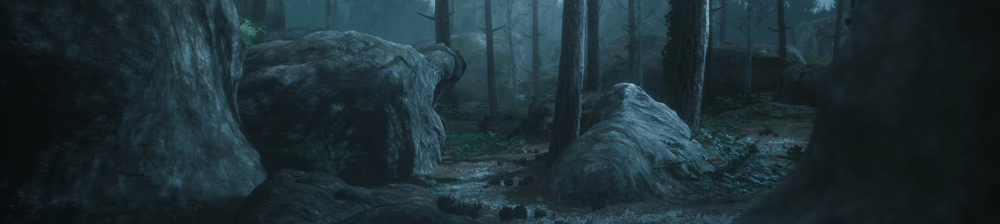

# HDRP Sample Projects

To explore more complex usages of the High Definition Render Pipeline (HDRP), you have access to several fully interactive Unity Projects.

These projects are hosted on Unity Technology's GitHub. 

When you clone the Project's repository, make sure to use git or a git client. This is because if you use the Green button on the GitHub website, it does not download all the Assets.

## Fontainebleau

https://github.com/Unity-Technologies/FontainebleauDemo

This Projects demonstrates how to use Photogrammetry to create game ready Assets.

Graphics Features used :

- Shader Graph (Wind animation)
- Contact Shadows
- SubSurface Scattering, Hair and Fabric Shaders (third person character)
- Volumetric fog

## Spaceship

https://github.com/Unity-Technologies/SpaceshipDemo

This Project demonstrates how to use the Visual Effect Graph to create interactive AAA grade Visual Effects.

Graphics features used :

- Visual Effect Graph
- Volumetric fog
- Area Lights
- Decals
- Screen Space reflections
- GPU Lightmapper

## VR Alchemy Lab

https://github.com/Unity-Technologies/VRAlchemyLab

This Project shows the use of HDRP rendering features in the context of a VR interactive demo.

Graphics features used :

- Visual Effect Graph
- Shader Graph
- Refraction
- Custom Render Texture
- Custom Pass
- Object Motion Blur
- Decals

