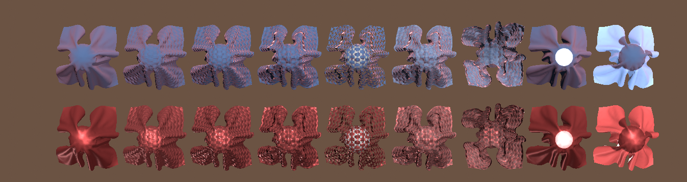

# Fabric Master Node

You can use the Fabric Material to render various types of fabric in the High Definition Render Pipeline (HDRP). The fabric Material uses either cotton wool or anisotropic silk as its base and supports various additional effects, such as [Subsurface Scattering](Subsurface-Scattering.md), to give you the ability to create realistic looking fabrics.

## Creating and editing a Fabric Material

Fabric Materials use a Shader Graph Master Node which means you cannot edit any of its properties in the Inspector. Fabric Materials use a Shader Graph Master Node, so you need to use a specific process to create and edit a Material that uses it. For information on how to do this, see [Customizing HDRP materials with Shader Graph](Customizing-HDRP-materials-with-Shader-Graph.md). 

When you apply the node to a Material, the **Surface Options** and **Exposed Properties** become available to edit in the Material’s Inspector.

## Properties

There are properties on the Master Node, and properties on each Material. Master Node properties are inside the Shader Graph itself, in two sections:

* **[Master Node input ports](#InputPorts)**: This section contains Shader Graph input ports on the Master Node itself. You can connect these to the output of other nodes or, in some cases, add your own values to them.
* **[Master Node settings menu](#SettingsMenu)**: This section contains Settings you can use to customize your Master Node and expose more input ports.

 [Material properties](#MaterialProperties) are in the Inspector window for Materials that use this Shader.

### Fabric Master Node input ports

The following table describes the input ports on a Fabric Master Node, including the property type and Shader stage used for each port. For more information on Shader stages, see [Shader Stage](https://docs.unity3d.com/Packages/com.unity.shadergraph@latest/index.html?subfolder=/manual/Shader-Stage.html).

| **Property**           | **Type**          | **Stage** | **Description**                                              |
| ---------------------- | ----------------- | --------- | ------------------------------------------------------------ |
| **Vertex Position**    | Vector 3          | Vertex    | The object space position of the Material per vertex.        |
| **Vertex Normal**      | Vector 3          | Vertex    | The object space normals of the Material.                    |
| **Vertex Tangent**     | Vector 3          | Vertex    | The object space tangent of the Material.                    |
| **BaseColor**          | Vector 3          | Fragment  | The color of the Material. To assign an image, connect a sampled Texture2D to this Master Node. |
| **SpecularOcclusion**  | Float             | Fragment  | A multiplier for the intensity of specular global illumination. This port only appears when you set **Specular Occlusion Mode** to **Custom**. |
| **Normal**             | Vector 3          | Fragment  | The normal of the point in tangent space.  To handle this property, you should use multiple maps. One map for the base and one map for the fabric thread that adds the additional details. |
| **BentNormal**         | Vector 3          | Fragment  | The [bent normal](Glossary.md#BentNormalMap) of the point.   |
| **Smoothness**         | Float             | Fragment  | The appearance of the primary specular highlight. Every light ray that hits a smooth surface bounces off at predictable and consistent angles. For a perfectly smooth surface that reflects light like a mirror, set this to a value of 1. For a rougher surface, set this to a lower value. |
| **AmbientOcclusion**   | Float             | Fragment  | A multiplier for the intensity of diffuse global illumination. Set this to **0** to remove all global illumination. |
| **SpecularColor**      | Vector 3          | Fragment  | The color of the specular highlight. To assign an image, connect a sampled Texture2D to this Master Node. |
| **Diffusion Profile**  | Diffusion Profile | Fragment  | Specifies which [Diffusion Profile](Diffusion-Profile.md) the Material uses for subsurface scattering and/or transmission. This port only appears when you enable **Subsurface Scattering** or **Transmission**. |
| **SubsurfaceMask**     | Float             | Fragment  | Indicates whether subsurface scattering should affect the shaded point. This port only appears when you enable the **Subsurface Scattering** setting. |
| **Thickness**          | Float             | Fragment  | The thickness of the surface that HDRP uses to evaluate transmission. This port only appears when you enable the **Transmission** setting. |
| **Tangent**            | Vector 3          | Fragment  | The tangent of the point in tangent space. This is useful when the surface has a non-null anisotropy value. This port only appears when you set **Material Type** to **Silk**. |
| **Anisotropy**         | Float             | Fragment  | The degree of asymmetry in the specular term with regards to the local basis of the point. This port only appears when you set **Material Type** to **Silk**. |
| **Emission**           | Vector 3          | Fragment  | The Material's emission color value. The RGB values you assign should be between 0-255. The Intensity value should be within the range **-10** and **10**. |
| **Alpha**              | Float             | Fragment  | The Material's alpha value. The Material uses this for transparency and/or alpha clip. HDRP expects a range from **0** to **1**. This port only appears when you set **Material Type** to **Silk**. |
| **AlphaClipThreshold** | Float             | Fragment  | The alpha value limit that HDRP uses to determine whether it should render each pixel of the Material. If the alpha value of the pixel is equal to or higher than this threshold then HDRP renders the pixel. If the value is lower than this threshold then HDRP does not render the pixel. This port only appears when you enable the **Alpha Clipping** setting. |
| **BakedGI**            | Vector 3          | Fragment  | Replaces the built-in diffuse global illumination (GI) solution with a value that you can set. This is for the front [face](Glossary.md#Face) of the Mesh only. This port only appears when you enable the **Override Baked GI** setting. |
| **BakedBackGI**        | Vector 3          | Fragment  | Replaces the built-in diffuse GI solution with a value that you can set. This is for the back [face](Glossary.md#Face) of the Mesh only. This port only appears when you enable the **Override Baked GI** setting. |
| **DepthOffset**        | Float             | Fragment  | The value that the Shader uses to increase the depth of the fragment by. This port only appears when you enable the **Depth Offset setting**. |

### Fabric Master Node settings menu

To view these properties, click the **Cog** in the top right of the Master Node.

| **Property**                   | **Description**                                              |
| ------------------------------ | ------------------------------------------------------------ |
| **Precision**                  | Select the precision of the calculations that the Shader processes. Lower precision calculations are faster but can cause issues, such as incorrect intensity for specular highlights. &#8226; **Inherit**: Uses global precision settings. This is the highest precision setting, so using it does not result in any precision issues, but Shader calculations are slower than other values. &#8226; **Float**: Uses single-precision floating-point instructions. This makes each calculation less resource-intensive, which speeds up calculations. &#8226; **Half**: Uses half-precision floating-point instructions. This is the fastest precision level, which means that calculations that use it are the least resource-intensive to process. This precision setting is the most likely one to result in issues, such as quantization (banding) artifacts and intensity clipping. |
| **Surface Type**               | Use the drop-down to define whether your Material supports transparency or not. Materials with the **Transparent Surface Type** are more resource intensive to render than Materials with the **Opaque Surface Type**. HDRP exposes more properties, depending on the **Surface Type** you select. |
| **- Blend Preserves Specular** | Indicates whether alpha blending affects the specular lobes. Useful for rendering windows for instance. |
| **- Fog**                      | Enable the checkbox to allow fog to affect the transparent surface. When disabled, HDRP does not take this Material into account when it calculates the fog in the Scene. To expose this option, select Transparent from the Surface Type drop-down. |
| **- Sort Priority**            | Allows you to change the rendering order of overlaid transparent surfaces. |
| **- Depth Write**              | Enable the checkbox to make HDRP write depth values for transparent GameObjects that use this Material. |
| **- Depth Test**               | Unity uses DepthTest when rendering an object, to check if it is behind another object. Unity does this by testing the z-value of a given Objects pixel and comparing against a value stored in the depth buffer. By default, DepthTest is set to Less Equal, allowing the original object to appear in front of the object it is tested against. Use the drop-down to select the comparison function to use for the depth test. Each comparison function changes how the Shader renders. To expose this option, select Transparent from the Surface Type drop-down. &#8226; **Disabled**: Do not perform a depth test. &#8226; **Never**: The depth test never passes. &#8226; **Less**: The depth test passes if the pixel's z-value is less than the stored value. &#8226; **Equal**: The depth test passes if the pixel's z-value is equal to the stored value. &#8226; **Less Equal**: The depth test passes if the pixel's z-value is less than or equal than the Z-buffers value. This renders the tested pixel in front of the other. &#8226; **Greater**: The depth test passes if the pixel's z-value is greater than the stored value. &#8226; **Not Equal**: The depth test passes if the pixel's z-value is not equal to the stored value. &#8226; **Greater Equal**: The depth test passes if the pixel's z-value is greater than or equal to the stored value. &#8226; **Always**: The depth test always passes, there is no comparison to the stored value. |
| **Alpha Clipping**             | Enable the checkbox to make this Material act like a [Cutout Shader](https://docs.unity3d.com/Manual/StandardShaderMaterialParameterRenderingMode.html). Enabling this feature exposes more properties. For more information about the feature and for the  list of properties this feature exposes, see the [Alpha Clipping documentation](Alpha-Clipping.md). |
| **Double-Sided**               | Specifies whether HDRP renders both faces of the polygons in your geometry. You can also specify how HDRP interprets the normals for the back face. The options are: &#8226; **Enabled**: HDRP renders both faces of polygons in your geometry. &#8226; **Disabled**: HDRP does not render both faces of polygons in your geometry. &#8226; **Flipped Normals**: The normal of the back face is 180° of the front facing normal. This also applies to the Material which means that it looks the same on both sides of the geometry. &#8226; **Mirrored Normals**: The normal of the back face mirrors the front facing normal. This also applies to the Material which means that it inverts on the back face. This is useful when you want to keep the same shapes on both sides of the geometry, for example, for leaves. |
| **Energy Conserving Specular** | Enable the checkbox to make HDRP reduce the diffuse color of the Material if the specular effect is more intense. This makes the lighting of the Material more consistent, which makes the Material look more physically accurate. |
| **Material Type**              | Specifies the type of Material the fabric Shader represents. The options are: &#8226; **Cotton Wool**: A  variant inspired by the Imageworks’s cloth model. &#8226; **Silk**: A fabric variant based on an anisotropic GGX BRDF Model. |
| **Subsurface Scattering**      | Indicates whether the Material supports subsurface scattering. To disable subsurface scattering in specific regions of the Material, use the **Subsurface Mask**. |
| **Transmission**               | Indicates whether the Material supports transmission.        |
| **Receive Decals**             | Enable the checkbox to allow HDRP to draw decals on this Material’s surface. |
| **Receive SSR (Transparent)**  | Indicates whether HDRP includes this Material when it processes the screen space reflection pass. There is a separate option for transparent Surface Type.|
| **Add Precomputed Velocity**   | Indicates whether this Material uses precomputed velocity information stored in an Alembic file. |
| **Specular Occlusion Mode**    | Set the mode that HDRP uses to calculate specular occlusion. &#8226; **Off**: Disables specular occlusion. &#8226; **From AO**: Calculates specular occlusion from the ambient occlusion map and the Camera's view vector. &#8226; **From AO and Bent Normal**: Calculates specular occlusion from the ambient occlusion map, the bent normal map, and the Camera's view vector. &#8226; **Custom**: Allows you to specify your own specular occlusion values. |
| **Override Baked GI**          | Enable this setting to expose two baked GI [input ports](#InputPorts). This makes this Materials ignore global illumination in your Scene and, instead, allows you to provide your own global illumination values and customize the way this Material looks. |
| **Depth Offset**               | Enable this setting to expose the DepthOffset [InputPort](#InputPorts) which you can use to increase the depth value of the fragment and push it away from the Camera. |
| **Support LOD CrossFace**      | Indicates whether dithering occurs when moving from one LOD level to another when sampling Textures. |
| **Override ShaderGUI**         | Lets you override the [ShaderGUI](https://docs.unity3d.com/ScriptReference/ShaderGUI.html) that this Shader Graph uses. If `true`, the **ShaderGUI** property appears, which lets you specify the ShaderGUI to use. |
| **- ShaderGUI**                  |  The full name of the ShaderGUI class to use, including the class path. |

### Material Properties

These properties are in the **Exposed Properties** section of the Inspector, alongside the properties that you exposed in the Shader Graph's Blackboard. If you set **Override ShaderGUI** to `true`, the Material Properties section does not appear, and instead, the ShaderGUI you specified appears.

| **Property**                           | **Description**                                              |
| -------------------------------------- | ------------------------------------------------------------ |
| **Enable GPU Instancing**              | Enable the checkbox to tell HDRP to render Meshes with the same geometry and Material in one batch when possible. This makes rendering faster. HDRP cannot render Meshes in one batch if they have different Materials, or if the hardware does not support GPU instancing. For example, you cannot [static-batch](https://docs.unity3d.com/Manual/DrawCallBatching.html) GameObjects that have an animation based on the object pivot, but the GPU can instance them. |
| **Emission**                           | Toggles whether emission affects global illumination. |
| **- Global Illumination**              | The mode HDRP uses to determine how color emission interacts with global illumination. &#8226; **Realtime**: Select this option to make emission affect the result of real-time global illumination. &#8226; **Baked**: Select this option to make emission only affect global illumination during the baking process. &#8226; **None**: Select this option to make emission not affect global illumination. |
| **Motion Vector For Vertex Animation** | Enable the checkbox to make HDRP write motion vectors for GameObjects that use vertex animation. This removes the ghosting that vertex animation can cause. |

## Limitations

[!include]