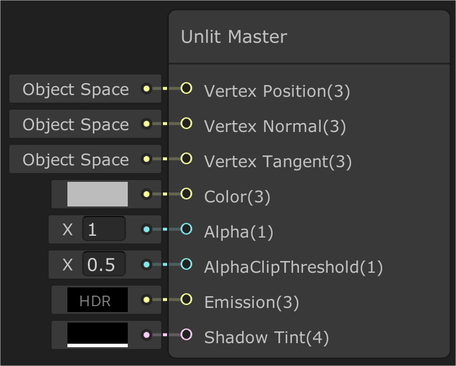

# Unlit master node

An Unlit Master node makes the Shader surface appear unlit, which means the surface is not affected by light. The node provides more properties to the Shader than the standard Unlit Shader. This is a Shader Graph Master node, which means that when you select it in the Project view you cannot edit any properties in the Inspector. However, when you apply the node to a Material, the Surface Options and Exposed Properties become available to edit in the Inspector.

## Creating and editing an Unlit Material

Unlit Materials use a Shader Graph Master node which means that you need to use a specific method to create and edit a Material that uses it. For information on how to do this, see [Customizing HDRP materials with Shader Graph](Customizing-HDRP-materials-with-Shader-Graph.html). When you create a Material from the Shader Graph, the properties that you exposed in the Blackboard appear in the **Exposed Properties** section.

## Properties

There are properties on the master node as well as properties on the Materials that use it. [Material properties](#MaterialProperties) are in the Inspector for Materials that use this Shader, and the master node properties are inside the Shader Graph itself in two sections:

- **[Master node input ports](#InputPorts)**: Shader Graph input ports on the master node itself that you can connect to the output of other nodes or, in some cases, add your own values to.
- **[Master node settings menu](#SettingsMenu)**: Settings you can use to customize your master node and expose more input ports.

### Unlit Master node input ports

|||
|:--:|:--:|
| Default | With ShadowMatte enabled|

The following table describes the input ports on an Unlit Master node, including the property type and Shader stage used for each port. For more information on Shader stages, see [Shader stage](https://docs.unity3d.com/Packages/com.unity.shadergraph@6.9/manual/Shader-Stage.html).

| **Property**                              | **Type** | **Stage** | **Description**                                              |
| ----------------------------------------- | -------- | --------- | ------------------------------------------------------------ |
| **Position**                              | Vector 3 | Vertex    | Defines the absolute object space position of the Material per vertex.|
| **Color**             		            | Vector 3 | Fragment  | Defines the color of the Material. To assign an image, connect a Sample Texture2D to this Master node. |
| **Alpha**				                    | Vector 1 | Fragment  | Defines the Material's alpha value. Used for transparency and/or alpha clip. Expected range 0 - 1.|
| **AlphaClipThreshold**                    | Vector 1 | Fragment  | Set the alpha value limit that HDRP uses to determine whether it should render each pixel of the Material. If the alpha value of the pixel is equal to or higher than this threshold then HDRP renders the pixel. If the value is lower than this threshold then HDRP does not render the pixel. This port only appears when you enable the **Alpha Clipping** setting.|
| **Emission**                           	| Vector 3 | Fragment  | Defines the Material's emission color value. Expects positive values.|
| **Shadow Tint**                              | Vector 4 | Fragment  | Defines the shadow color value with alpha value. Enable only if Shadow Matte enable cf. [Master node settings menu](#SettingsMenu)|

### Unlit Master node settings menu

To view these properties, click the **Cog** icon in the top right of the master node.

| **Property**                     | **Description**                                              |
| -------------------------------- | ------------------------------------------------------------ |
| **Precision**                            	|Select the precision of the calculations that the Shader processes. Lower precision calculations are faster but can cause issues, such as incorrect intensity for specular highlights. &#8226; **Inherit:** Uses global precision settings. This is the highest precision setting, so using it does not result in any precision issues but Shader calculations are slower than other values.  &#8226; **Float:** Uses single-precision floating-point instructions. This makes each calculation less resource-intensive, which speeds up calculations.  &#8226; **Half:** Uses half-precision floating-point instructions. This is the fastest precision level, which means that calculations that use it are the least resource-intensive to process. This precision setting is the most likely one to result in issues, such as quantization (banding) artifacts and intensity clipping. Half precision is currently experimental for the Unlit Shader|
| **Surface Type** 			           	    |&#8226; **Opaque:** Makes the surface of the Material non-transparent.  &#8226; **Transparent:** Makes the surface of the Material see-through. |
| **Rendering Pass**                        |Use the drop-down to set the rendering pass that HDRP processes this Material in.  &#8226; **Before Refraction:** Draws the GameObject before the refraction pass. This means that HDRP includes this Material when it processes refraction. To expose this option, select **Transparent** from the **Surface Type** drop-down.  &#8226; **Default:** Draws the GameObject in the default opaque or transparent rendering pass, depending on the **Surface Type**.  &#8226; **Low Resolution:** Draws the GameObject in half resolution after the forward transparent pass. To expose this option, select Transparent from the Surface Type drop-down.  &#8226; **After post-process:** For [Unlit Materials](Unlit-Shader.html) only. Draws the GameObject after all post-processing effects. |
| **Blending Mode**            				|Use the drop-down to determine how HDRP calculates the color of each pixel of the transparent Material by blending the Material with the background pixels. To expose this option, select **Transparent** from the **Surface Type** drop-down.  &#8226; **Alpha:** Uses the Material’s alpha value to change how transparent an object is. 0 is fully transparent. 1 appears fully opaque, but the Material is still rendered during the Transparent render pass. This is useful for visuals that you want to be fully visible but to also fade over time, like clouds.  &#8226; **Additive:** Adds the Material’s RGB values to the background color. The alpha channel of the Material modulates the intensity. A value of 0 adds nothing and a value of 1 adds 100% of the Material color to the background color.  &#8226; **Premultiply:** Assumes that you have already multiplied the RGB values of the Material by the alpha channel. This gives better results than Alpha blending when filtering images or composing different layers. |
| **Sorting Priority**                 		|Allows you to change the rendering order of overlaid transparent surfaces.|
| **Receive Fog**                           |Enable the checkbox to allow fog to affect the transparent surface. When disabled, HDRP does not take this Material into account when it calculates the fog in the Scene. To expose this option, select **Transparent** from the **Surface Type** drop-down.|
| **Distortion**                  			|Enable or disable the Distortion of the Shader. To expose this option, select **Transparent** from the **Surface Type** drop-down.|
| **Depth Write**  				|Enable the checkbox to make HDRP write depth values for transparent GameObjects that use this Material. To expose this option, select **Transparent** from the **Surface Type** drop-down.|
| **Cull Mode** 							|Use the drop-down to select which face to cull for transparent GameObjects that use this Material. To expose this option, select **Transparent** from the **Surface Type** drop-down.  &#8226; **Front:** Culls the front face of the geometry.  &#8226; **Back:** Culls the back face of the geometry.|
| **DepthTest**    					|Unity uses DepthTest when rendering an object, to check if it is behind another object. Unity does this by testing the Z-value of a given Objects pixel and comparing against a value stored in the Z-buffer. By default, DepthTest is set to Less Equal, allowing the original object to appear in front of the object it is tested against. Use the drop-down to select the comparison function to use for the depth test. Each comparison function changes how the Shader renders. To expose this option, select **Transparent** from the **Surface Type** drop-down.  &#8226; **Disabled:** Do not perform a ZTest.  &#8226; **Never:** The ZTest is never passed.  &#8226; **Less:** The ZTest passes if the pixels Z-value is less than the stored value.  &#8226; **Equal:** The ZTest passes if the pixels Z-value is equal to the stored value.  &#8226; **Less Equal:** The ZTest passes if the pixels Z-value is less than or equal than the Z-buffers value. This renders the tested pixel in front of the other.  &#8226; **Greater:** The ZTest passes if the pixels Z-value is greater than the stored value.  &#8226; **Not Equal:** The ZTest passes if the pixels Z-value is not equal to the stored value.  &#8226; **Greater Equal:** The ZTest passes if the pixels Z-value is greater than or equal to the stored value.  &#8226; **Always:** The ZTest always passes, there is no comparison to the stored value.|
| **Double Sided**     						|Enable or disable whether or not the Shader should be rendered on both sides of a geometry.|
| **Alpha Clipping**                 		|Enable or disable Alpha Clipping. This controls whether your Shader acts as a Cutout Shader or not. Cutout Shader is a Shader type that has both Opaque and Transparent parts.|
| **Shadow Matte**                          |Enable or disable whether or not the Shader receive the shadow.|
| **Override ShaderGUI**                  |Lets you override the [ShaderGUI](https://docs.unity3d.com/ScriptReference/ShaderGUI.html) that this Shader Graph uses. If `true`, the **ShaderGUI** property appears, which lets you specify the ShaderGUI to use. |
| **- ShaderGUI**                           |The full name of the ShaderGUI class to use, including the class path.|

### Material Inspector

These properties are in the **Exposed Properties** section of the Inspector and sit alongside the properties that you exposed in the Shader Graph's Blackboard. If you set **Override ShaderGUI** to `true`, the Material Properties section does not appear, and instead, the ShaderGUI you specified appears.

| **Property**                           | **Description**                                              |
| -------------------------------------- | ------------------------------------------------------------ |
| **Enable GPU Instancing**              | Enable the checkbox to tell HDRP to render Meshes with the same geometry and Material in one batch when possible. This makes rendering faster. HDRP cannot render Meshes in one batch if they have different Materials, or if the hardware does not support GPU instancing. For example, you cannot [static-batch](https://docs.unity3d.com/Manual/DrawCallBatching.html) GameObjects that have an animation based on the object pivot, but the GPU can instance them. |
| **Double Sided Global Illumination**   | When enabled, the lightmapper accounts for both sides of the geometry when calculating Global Illumination. Backfaces are not rendered or added to lightmaps, but get treated as valid when seen from other objects. When using the Progressive Lightmapper, backfaces bounce light using the same emission and albedo as frontfaces. |
