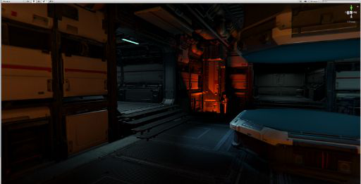

# MatCap mode

In MatCap mode, the High Definition Render Pipeline (HDRP) replaces the functionality of the Scene window's Lighting button with a material capture (MatCap) view. MatCap mode uses an image that completely captures a Material, including baked-in lighting. When using MatCap mode, HDRP replaces all of the Materials and lighting in the Scene with what is in the MatCap.

MatCap mode is particularly useful to navigate and get a sense of the Scene without setting up the Scene lighting. For example, if you were to edit a dark area, like the inside of a cave, it would be difficult to navigate with low lighting MatCap mode makes it much easier to navigate in such dark areas.

## Using MatCap

To activate MatCap mode, disable the Lighting toggle in the Scene window.

MatCap mode preserves the normal maps and you can use the original Material albedo. To configure MatCap mode, go to **Edit > Preferences > HD Render Pipeline** and use the following properties.

## Properties

| **Property**                  | **Description**                                              |
| ----------------------------- | ------------------------------------------------------------ |
| **Mix Albedo in MatCap Mode** | Enable the checkbox to make HDRP mix the albedo of the Material with its material capture. |
| **MatCap Intensity Scale**    | Set the intensity of the material capture. This increases the brightness of the Scene. This is especially useful if the albedo darkens the Scene considerably. |

## Default material captures

HDRP provides neutral and metallic default MatCaps. You can change the MatCap in your [HDRP Asset's](HDRP-Asset.md) **HDRenderPipelineResources**. To do this:

1. Select the HDRP Asset in the Project window to view it in the Inspector.
2. Go to the **General** section and double-click on the Asset assigned to the **Render Pipeline Resources** property to view that in the Inspector.
3. Go to the **Textures** section and assign your custom MatCap Texture to the **MatCap Tex** property.

You can also activate MatCap view as a **Lighting Debug Mode** in the [Render Pipeline Debugger](Render-Pipeline-Debug-Window.md).

## MatCap examples

**MatCap off:**

**MatCap on:**

**MatCap on with albedo:**

