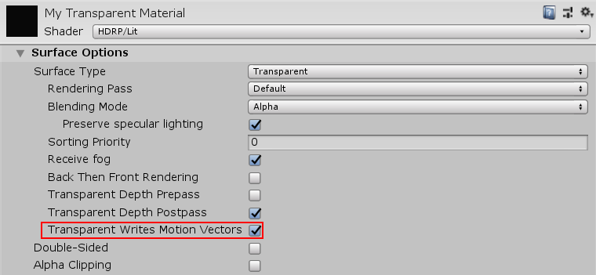

# Motion vectors in HDRP

Motion vectors capture the per-pixel, screen-space motion of GameObjects from one frame to the next. To compute motion vectors for a GameObject, HDRP uses the difference between the GameObject’s position in the current and previous frame.

HDRP uses motion vectors for various effects such as [temporal anti-aliasing (TAA)](Glossary.md#TemporalAntiAliasing) and motion blur.

## Using motion vectors

To use motion vectors in HDRP, you must enable them:

1. In your Unity Project’s [HDRP Asset](HDRP-Asset.md)
2. In your [Frame Settings](Frame-Settings.md)

In the Inspector for your HDRP Asset, navigate to the **Rendering** section and enable the **Motion Vectors** checkbox. You can then either enable motion vectors for all Cameras or on an individual, per-Camera level. To enable motion vectors for all Cameras, navigate to **Default Frame Settings For > Rendering** and enable the **Motion Vectors** checkbox. This enables Camera motion vectors. Now you can also enable the **Object Motion Vectors** checkbox. If you do this, HDRP calculates object motion vectors. If you keep this checkbox disabled, HDRP only calculates Camera motion vectors.

HDRP calculates motion vectors in two stages:

1. HDRP first calculates object motion vectors. To make a Mesh Renderer write object motion vectors, in its Inspector, go to **Additional Settings** and select **Per Object Motion** from the **Motion Vectors** drop-down. HDRP now calculates object motion vectors for this Mesh Renderer, if you enable **Object Motion Vectors** in the Frame Settings.

2. HDRP then calculates Camera motion vectors, which are caused by the movement of the Camera. This is for pixels that did not write motion vectors during the first stage. To make HDRP calculate Camera motion vectors for a Mesh Renderer, in the Inspector for the Mesh Renderer, go to **Additional Settings** and select **Camera Motion Only** from the **Motion Vectors** drop-down.

If you do not want HDRP to calculate motion vectors for a Mesh Renderer at all, in the Inspector for the Mesh Renderer, go to **Additional Settings** and select **Force No Motion** from the **Motion Vectors** drop-down.

## Motion vectors for transparent objects

By default, HDRP does not render motion vectors for transparent Materials. This is because motion vectors from transparent GameObjects overwrite motion vectors for GameObjects behind them. For example, a window would overwrite the motion vectors for a bird flying behind it.

To make HDRP render motion vectors for transparent Materials:

1. In the Inspector for your HDRP Asset, go to **Default Frame Settings For > Rendering** and enable the **Transparent Writes Motion Vectors** checkbox.
2. In the Inspector for your transparent Material, go to **Surface Options** and enable the **Transparent Writes Motion Vectors** checkbox.

When transparent objects write motion vectors on a given pixel, they replace that pixel’s previous motion vectors. This is particularly useful for Materials that use alpha clipping, such as hair. 
If you use motion blur in conjunction with transparent GameObjects, be aware that motion blur also uses depth information. This means that you should make the Material write depth information too. To do this, go to **Surface Options** and enable the **Transparent Depth Postpass** checkbox.
