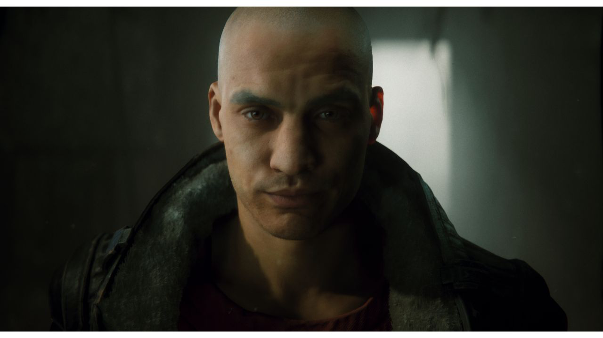

# Post-processing in the High Definition Render Pipeline

The High Definition Render Pipeline (HDRP) includes its own purpose-built implementation for [post-processing](https://docs.unity3d.com/Manual/PostProcessingOverview.html). This is built into HDRP, so you do not need to install any other package.

This implementation uses the [Volume](Volumes.md) system. You add post-processing effects to your Camera in the same way you add any other [Volume Override](Volume-Components.md). Note that HDRP already enables some post-processing effects in the [Default Settings Volume Profile](Default-Settings-Window.md).

The images below show a Scene with and without HDRP post-processing.

Without post-processing:

With post-processing:

