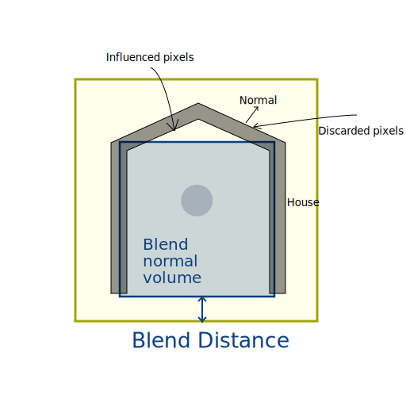

# Reflection probe usage

## What is a probe

Reflection probes and planar reflection probes provide indirect specular lighting.

A probe capture its surroundings and will influence specular lighting in a specific volume.
A reflection probe will capture all of its surroundings while a planar reflection probe will capture only one direction.

## Controlling the influence of a probe

The influence of a probe determines which pixels will be affected and by how much.

There are 3 tools to control the influence on a pixel:
* Influence volume: any pixel inside this volume will be affected.
* Blend distance: pixel near the border of the volume will be less influenced.
* Blend normal distance: pixels near the border with an invalid normal won't be affected.

### Influence volume

Use this volume to include or exclude pixels to be influenced.

Note: When a pixel is inside an influence volume it will be _processed_ by the probe, even if specular value provided by the probe is not significant. This is important to handle performance of probes.

### Blend influence

Between the influence volume and the blend volume, the specular lighting value provided by the probe is linearly weighted.
Use the blending to make smooth transition at the border of the influences of a probe or when probes are overlapping.

### Blend normal influence

In some cases, a probe influence can "bleed", it does influence a pixel that makes no sense to be influenced.

This is the case when a light ray can not reach a pixel due to occlusion but is inside the influence volume.

You can set a blend normal distance similarly to a blend distance.
Pixels inside the influence volume but outside of the blend normal volume will not be influenced if their normal is pointing outward the probe.

