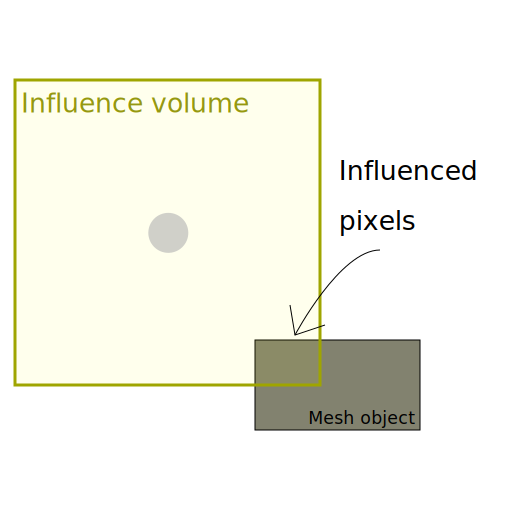
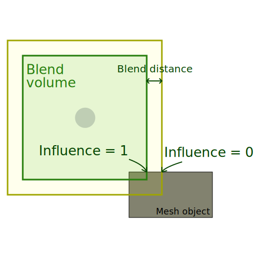
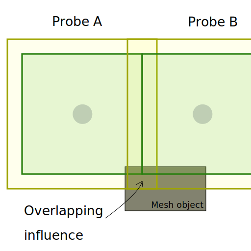

# Reflection probe usage

## What is a probe

[Reflection Probes](Reflection-Probe.md) and [Planar Reflection Probes](Planar-Reflection-Probe.md) provide indirect specular lighting.

A Reflection Probe captures all of its surroundings whereas a Planar Reflection Probe only captures one direction.

For more information on probes and how they work, see [Reflection Probes](Reflection-Probes-Intro.md).

## Controlling the influence of a probe

The influence of a probe determines which pixels it affects and by how much.

There are 3 tools to control the influence on a pixel:
* [Influence volume](#influence-volume): The probe affects any pixel inside this volume.
* [Blend distance](#blend-influence): The probe affects pixels near the border of the Influence volume less.
* [Blend normal distance](#blend-normal-influence): The probe does not affect pixels near the border with an invalid normal.

### Influence volume

Use this volume to include or exclude pixels from the probe's influence.

Note: When a pixel is inside an influence volume, the probe still processes it even if the specular value the probe provides is not significant. This is important to handle the performance of probes.

### Blend influence

Unity linearly weights the specular lighting value the probe provides between the influence volume and the blend volume.
Use blending to create smooth transitions at the border of the probe's influence, or when probes overlap.

### Blend normal influence

In some cases, a probe can influence a pixel that is not consistent with the scene layout.

For example, when a light ray cannot reach a pixel due to occlusion, but the pixel is inside the influence volume.

You can set a blend normal distance similarly to a blend distance.
The probe does not influence pixels that are inside the influence volume, but outside of the blend normal distance, if their normal points away from the probe.

