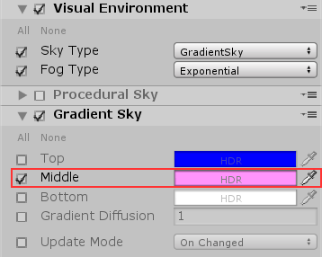

# Visual Environment

The Visual Environment Volume component override specifies the **Sky Type** and **Fog Type** that HDRP renders in the Volume.

| __Property__ | __Description__                                                  |
| -------- | ------------------------------------------------------------ |
| __Sky Type__ | The type of sky that HDRP renders when the Camera is inside the Volume. This list automatically updates when you write a new custom Sky. The default value is **Procedural Sky**. |
| __Fog Type__ | The type of fog that HDRP renders when the Camera is inside the Volume. The default value is **Exponential Fog**. |

This Visual Environment override comes as default when you create a **Scene Setting** GameObject (Menu: **GameObject > Rendering > Scene Settings**).

After you have set your **Sky Type** and **Fog Type**, if you want to override the default settings, you need to create an override for them on the Volume. For example, if you select **Gradient Sky** for your **Sky Type**, click **Add component overrides** and add a **Gradient Sky** Volume component. Now you can disable or remove the **Procedural Sky** override because the Volume will use the **Gradient Sky** Volume component and ignore **Procedural Sky**. Disable it by unticking the checkbox to the left of the Volume name, or remove it by clicking the drop-down menu to the right of the Volume title and selecting **Remove**. On the **Gradient Sky** override itself, you can enable the checkboxes next to settings to override them with your own values.

