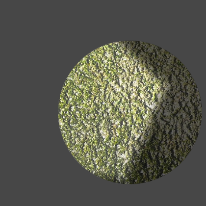
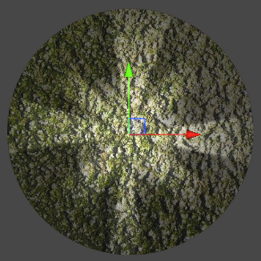

## Freeform

Select the **Freeform** Light type to create a Light from an editable polygon with a spline editor. To begin editing your shape, select the Light and find the button in its Inspector window. Select it to enable the shape editing mode.

Add new control points by clicking the mouse along the inner polygon’s outline. Remove control points selecting the point and pressing the Delete key.

The following additional properties are available to the **Freeform** Light type.

| Property              | Function                                                     |
| --------------------- | ------------------------------------------------------------ |
| **Falloff**           | Adjusts the falloff area of this light. The higher the falloff value, the larger area the falloff spans. |
| **Falloff Strength** | Adjusts the falloff curve to control the softness of this light’s edges. The higher the falloff strength, the softer the edges of this light.                      |

|  |  |
| ------------------------------------------ | ------------------------------------ |
| Freeform Light in edit mode                | Resulting Light Effect               |

When creating a **Freeform** Light, take care to avoid self-intersection as this may cause unintended lighting results. Self-intersection may occur by creating outlines where edges cross one another, or by enlarging falloff until it overlaps itself. To prevent such issues, it is recommended to edit the shape of the Light until the conditions creating the self-intersection no longer occur.

|  |  |
| ------------------------------------------------------------ | ------------------------------------------------------------ |
| Outline self-intersection in Edit mode.                      | Light effect with a black triangular artifact                |

|  |  |
| ------------------------------------------------------------ | ------------------------------------------------------------ |
| Falloff overlap in Edit mode                                 | Light effect with double lighted areas with overlapping falloff |

## Parametric

The **Parametric** light type has been deprecated. To convert existing Parametric lights to **Freeform** lights, Edit > Rendering > Lights > Upgrade Project/Scene URP Parametric Lights to Freeform

## Sprite

Select the **Sprite** Light type to create a Light based on a selected Sprite by assigning the selected Sprite to the additional Sprite property.

| Property   | Function                             |
| ---------- | ------------------------------------ |
| **Sprite** | Select a Sprite as the Light source. |

|  |  |
| --------------------------------------- | ---------------------------------------------- |
| Selected Sprite                         | Resulting Light effect                         |

## Spot

Select the **Spot** Light type for great control over the angle and direction of the selected Light with the following additional properties.

| Property         | Function                                                     |
| ---------------- | ------------------------------------------------------------ |
| **Radius Inner** | Set the inner radius here or with the gizmo. Light within the inner radius will be at maximum [intensity](2DLightProperties.md#intensity). |
| **Radius Outer** | Set the outer radius here or with the gizmo. Light intensity decreases to zero as it approaches the outer radius. |
| **Inner / Outer Spot Angle**  | Set the angles with this slider or with the gizmo. Light within the inner and outer angles will be at the intensity specified by inner and outer radius. |

|  |  |
| ------------------------------------------------ | ---------------------------------------------- |
| Point Light in Edit mode                         | Resulting Light effect                         |

## Global

Global Lights light all objects on the [targeted sorting layers](2DLightProperties.md#target-sorting-layers). Only one global Light can be used per [Blend Style](LightBlendStyles.md), and per sorting layer.
