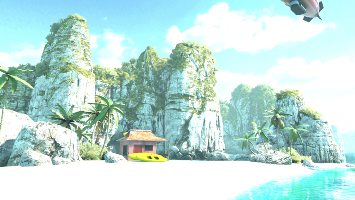

# Post-processing in the Universal Render Pipeline

URP contains its own integrated post-processing solution. URP 7.x also supports the Post Processing Stack v2 (PPv2) package, for backwards compatibility with existing projects. Both post-processing solutions are supported in the versions of URP that are compatible with Unity 2019.4 LTS. Starting with Unity 2020.1, only the integrated post-processing solution is supported.

## Post Processing Stack v2 (PPv2)

Refer to the [documentation for the PPv2 package](https://docs.unity3d.com/Packages/com.unity.postprocessing@latest).

## URP's integrated post-processing solution

URP's integrated post-processing solution uses the [Volume](Volumes.md) framework for post-processing effects.

The images below show a Scene with and without URP post-processing.

Without post-processing: 

With post-processing: 

> **Note:** URP does not support Post-processing on OpenGL&nbsp;ES&nbsp;2.0.

## How to configure post-processing effects in URP

This section describes how to configure Post-processing in URP.

### Using post-processing in the URP Template Scene

Post-processing is preconfigured in the SampleScene Scene in URP Template.

To see the preconfigured effects, select **Post-process Volume** in the Scene.

To add extra effects, [add Volume Overrides to the Volume](VolumeOverrides.md#volume-add-override).

To configure location-based post-processing effects, see [How to use Local Volumes](Volumes.md#volume-local).

### Configuring post-processing in a new URP Scene

To configure post-processing in a new Scene:

1. Select a Camera, and select the **Post Processing** check box.

    

2. Add a GameObject with a [Volume](Volumes.md) component in the Scene. This instruction adds a Global Volume. Select **GameObject > Volume > Global Volume**.

3. Select the **Global Volume** GameObject. In the Volume component, create a new Profile by clicking **New** button on the right side of the Profile property.

    

3. Add post-processing effects to the Camera by adding [Volume Overrides](VolumeOverrides.md#volume-add-override) to the Volume component.

    

Now you can adjust post-processing effect settings in Overrides in the Volume component.

To configure location-based post-processing effects, see [How to use Local Volumes](Volumes.md#volume-local).

### Post-processing in URP for mobile devices

Post-processing effects can take up a lot of frame time. If you’re using URP for mobile devices, these effects are the most “mobile-friendly” by default:

- Bloom (with __High Quality Filtering__ disabled)
- Chromatic Aberration
- Color Grading
- Lens Distortion
- Vignette

**Note:** For depth-of field, Unity recommends that you use Gaussian Depth of Field for lower-end devices. For console and desktop platforms, use Bokeh Depth of Field.

**Note:** For anti-aliasing on mobile platforms, Unity recommends that you use FXAA.

### Post-processing in URP for VR
In VR apps and games, certain post-processing effects can cause nausea and disorientation. To reduce motion sickness in fast-paced or high-speed apps, use the Vignette effect for VR, and avoid the effects Lens Distortion, Chromatic Aberration, and Motion Blur for VR.
