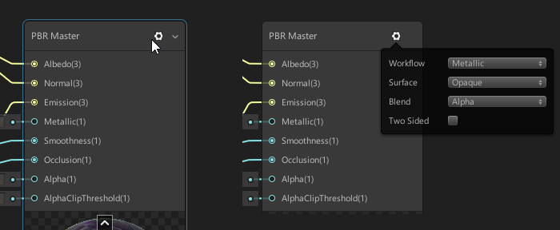
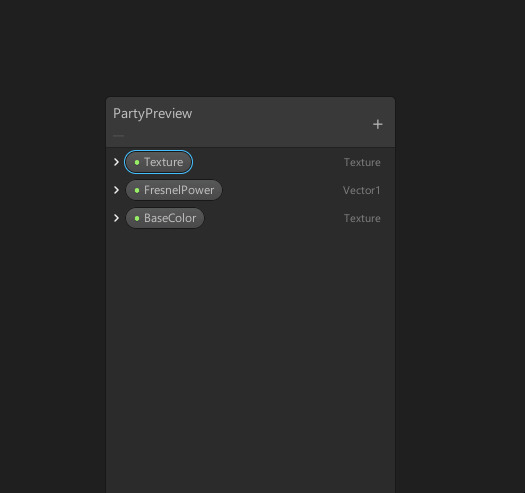
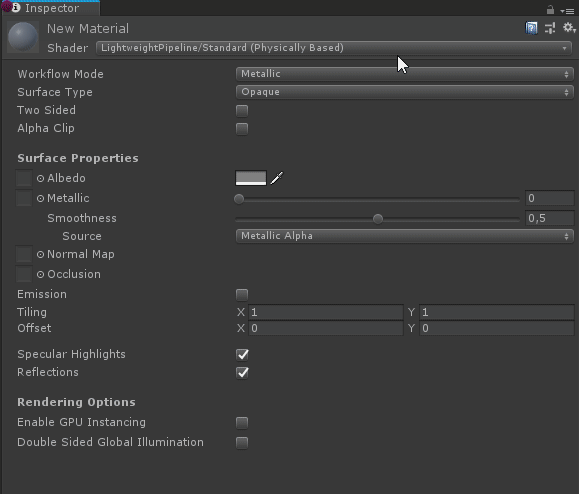
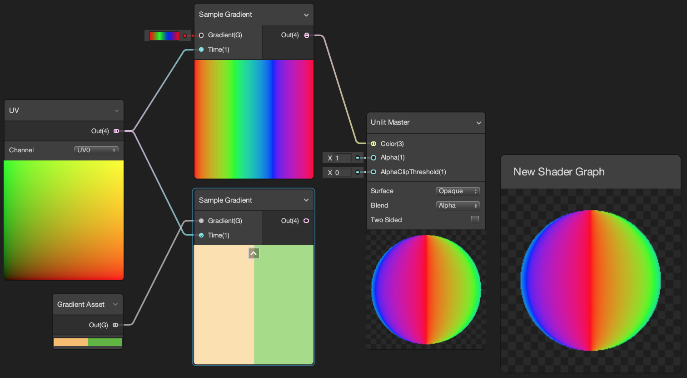

# Next version

### HD Render Pipeline support

Shader Graph now supports the High Definition Render Pipeline with both PBR and Unlit Master nodes. Shaders built with Shader Graph work with both the Lightweight and HD render pipelines.

### Vertex position

You can now modify vertex position via the Position slot on the PBR and Unlit Master nodes. By default, the input to this node is object space position. Custom inputs to this slot should specify the absolute local position of a given vertex. Certain nodes (such as Procedural Shapes) are not viable in the vertex shader. Such nodes are incompatible with this slot.

### Master node settings

The settings for master nodes now live in a small window that you can toggle on and off. Here, you can change various rendering settings for your shader.

### Property reference names and exposed state

You can now edit the Reference name for a property. To do so, select the property and type a new name next to Reference. If you want to reset to the default name, right-click Reference, and select Reset reference. 

In the expanded property window, you can now also toggle if the property is exposed.

### Editable paths for graphs

You can now change the path of Shader Graphs and Sub Graphs. When you change the path of a Shader Graph, this modifies the location it has in the shader selection list. When you change the path of Sub Graph, it will have a different location in the node creation menu.

### Is Front Face node

With this node, you can change graph output depending on the face sign of a given fragment. If the current fragment is part of a front face, the node returns True. For a back face, the node returns False.
Note: This functionality requires that you have enabled **two sided** on the Master node.

### Gradient nodes

This adds gradient functionality via two new nodes. The Sample Gradient node samples a gradient given a Time parameter. You can define this gradient on the Gradient slot control view. The Gradient Asset node defines a gradient that can be sampled by multiple Sample Gradient nodes using different Time parameters.

### Sphere Mask Node

With this node, you can create a sphere mask. Indicate the starting coordinate and center point. The sphere mask uses these with the **Radius** and **Hardness** parameters. Sphere mask functionality works in both 2D and 3D spaces, and is based on the vector coordinates in the **Coords and Center** input.

### Texture3D and Texture2D Array

This change expands Unity's support for Texture types via two new property types and four new nodes. These allow you to define and sample Texture 3D and Texture 2D Array type assets in Shader Graph.

### Texture 2D LOD node

This adds a new node for LOD functionality on a Texture 2D Sample. Sample Texture 2D LOD uses the exact same input and output slots as Sample Texture 2D, but also includes an input for level of detail adjustments via a Vector1 slot. 

### Show generated code

You can now see the generated code for any specific node. To do so, right-click the node, and select Show Generated Code. The code snippet will now open in the code editor that you have linked to Unity.

### Bug fixes and minor changes

- Vector 1 nodes now evaluate correctly. ([#334](https://github.com/Unity-Technologies/ShaderGraph/issues/334) and [#337](https://github.com/Unity-Technologies/ShaderGraph/issues/337))
- Properties can now be copied and pasted.
- Pasting a property node into another graph will now convert it to a concrete node. ([#300](https://github.com/Unity-Technologies/ShaderGraph/issues/300) and [#307](https://github.com/Unity-Technologies/ShaderGraph/pull/307))
- Nodes that are copied from one graph to another now spawn in the center of the current view. ([#333](https://github.com/Unity-Technologies/ShaderGraph/issues/333))
- When you edit sub graph paths, the search window no longer yields a null reference exception.
- The blackboard is now within view when deserialized.
- Your system locale can no longer cause incorrect commands due to full stops being converted to commas.
- Deserialization of subgraphs now works correctly.
- Sub graphs are now suffixed with (sub), so you can tell them apart from other nodes.
- Boolean and Texture type properties now function correctly in sub-graphs.
- The preview of a node does not obstruct the selection outliner anymore.
- The Dielectric Specular node no longer resets its control values.
- HD PBR subshader no longer duplicates surface description code into vertex shader.
- You can now copy, paste, and duplicate sub-graph nodes with vector type input ports.
- If the current render pipeline is not compatible, master nodes now display an error badge.
- The preview shader now only considers the current render pipeline. Because of this there is less code to compile, and therefore the preview shader will compile faster.
- When you rename a shader graph or sub shader graph locally on your disk, the title of the Shader Graph window, black board, and preview also updates.
