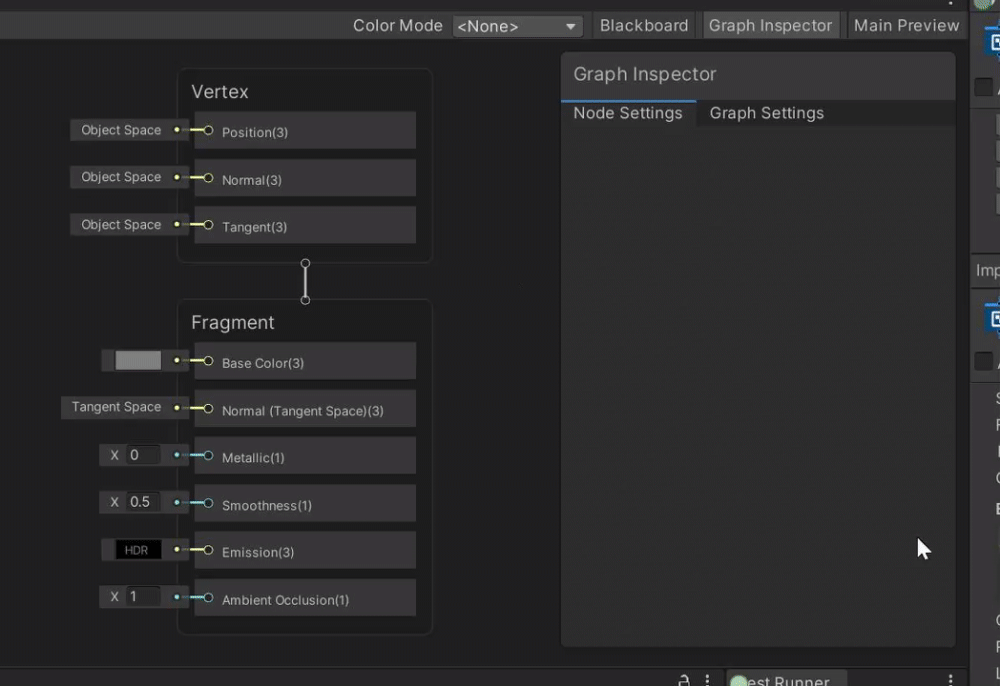
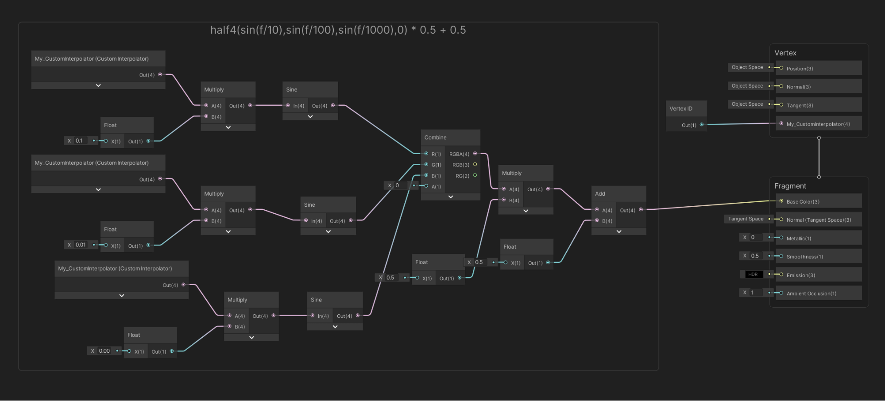

# Custom Interpolators

## Description

The Custom Interpolator feature provides fine-grained control over the specific calculations Shader Graph uses to bring data from the vertex stage to the pixel stage.

There are two target audiences for Custom Interpolators:

* Technical Directors and Lead Technical Artists setting up environments for their teams.
* Graphics programmers helping artists to optimize content performance.

## Supported data types
Custom interpolators support float, vec2, vec3, and vec4 options.

## Channel limits
The Custom Interpolator feature supports a maximum of 32 channels. A channel is equivalent to four floats. Each float is an interpolator variable.
Different platforms and GPUs have different interpolator variable limits. Exceeding the interpolator limitations of your target platform prevents your shaders from compiling. For detailed information about the number of interpolators supported by common interfaces, see the Unity documentation on [Shader semantics](https://docs.unity3d.com/Manual/SL-ShaderSemantics.html), and view the section **Interpolator count limits**. Test your Custom Interpolators on your target configuration to ensure that your content compiles properly.
Technical directors can set warnings and errors to help their team members avoid creating graphs with too many channels to be compatible with their target pipeline, platform, or GPU. See **Creating channel warnings and errors** below.

## How to use
To use this feature, create a Custom Interpolator block in the Vertex context of the Master Stack and set a name and a data type. Create a vertex node to write data to that interpolator. Use the interpolator in your graph, then connect your graph to the relevant block in the Fragment context.
These instructions include a contextual example illustrating the process of using a Custom Interpolator to fetch per-vertex data from a texture.
To read the HLSL you use to replicate this behavior with the Built In Render Pipeline, see the Unity documentation on [Shader semantics](https://docs.unity3d.com/Manual/SL-ShaderSemantics.html) and view the section **Vertex ID: SV_VertexID**.

### Creating channel warnings and errors

It is not possible to limit the number of channels a user can create in a Shader Graph. However, it is possible to create alerts to let users know when they are close to or exceeding a certain number of channels.
The **Warning Threshold** lets users know that they are approaching the channel limit, and the **Error Threshold** informs them if they have reached or surpassed that limit. The **Warning Threshold** value must be between 8 and 32 channels. The **Error Threshold** value must be higher than the **Warning Threshold**, and has a minimum value of 8 channels.
To configure these parameters, go to the Unity Editor [Project Settings](https://docs.unity3d.com/Manual/comp-ManagerGroup.html) menu and open the **Custom Interpolator Channel Settings**.

### Adding a Custom Interpolator block to the Master Stack

     

1. Right-click in the **Vertex** contex to create a block node.
2. Select **Custom Interpolator**.
3. Select a data type.
4. Enter a name for this interpolator.

In the illustrated example, you use the Vector 4 (vec4) data type.

### Writing data to the interpolator

 

1. Right-click in your graph to create a node.
2. Select the type **Vertex ID**.
3. Connect this node to the Custom Interpolator block.

In the example, you write Vertex ID values from your graph into the Custom Interpolator.

### Reading data from the interpolator

1. Right-click in your graph to create a node.
2. Select **Custom Interpolator**.
3. Connect the Custom Interpolator node to the relevant block in the Fragment context.

 

In this example, you connect to the **Base Color** block in order to pass the Vertex ID from the vertex shader to the fragment shader and use it as color output.

### Deleting the block from the Master Stack

If you delete a Custom Interpolator which is associated with nodes that are still in your graph, Unity displays an alert. If you want to keep using these nodes, you can create a new Custom Interpolator and associate them with it. This prevents the alert from appearing.
