# Input Nodes

## Basic

|[Boolean](Boolean-Node.md)|[Color](Color-Node.md)|
|:--------:|:------:|
|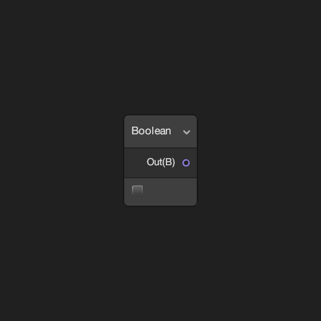|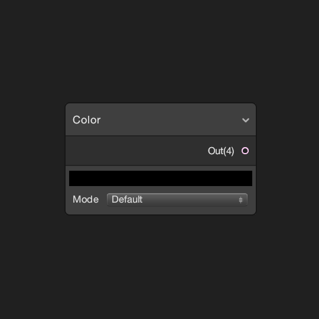|
| Defines a constant Boolean value in the shader. | Defines a constant Vector 4 value in the shader using a Color field. |
|[**Constant**](Constant-Node.md)|[**Integer**](Integer-Node.md)|
|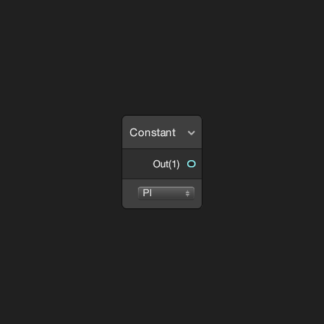|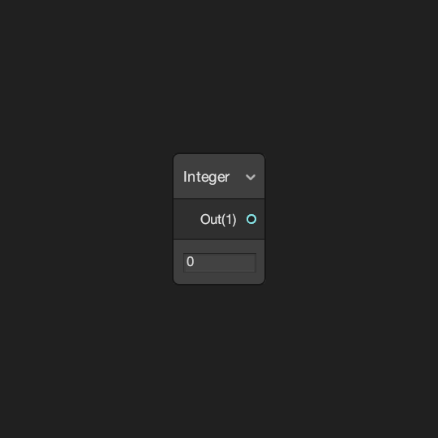|
|Defines a Float of a mathematical constant value in the shader.|Defines a constant Float value in the shader using an Integer field.|
|[**Slider**](Slider-Node.md)|[**Time**](Time-Node.md)|
|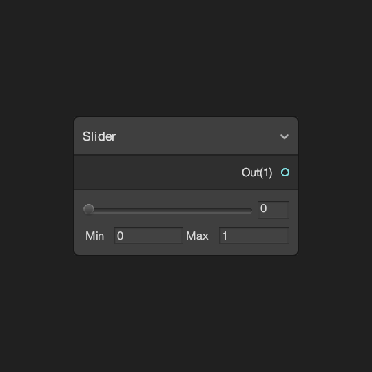|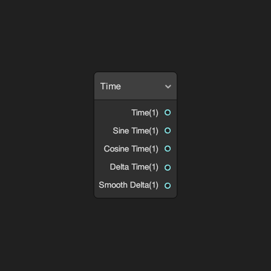|
|Defines a constant Float value in the shader using a Slider field.|Provides access to various Time parameters in the shader.|
|[**Float**](Float.md)|[**Vector 2**](Vector-2-Node.md)|
|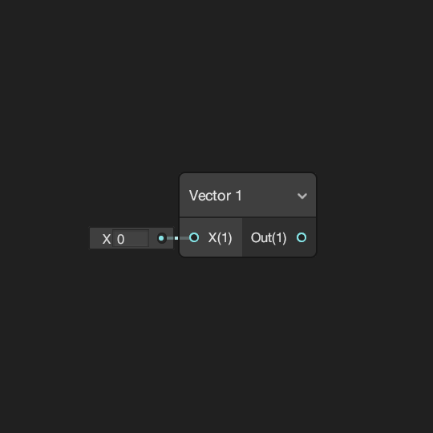|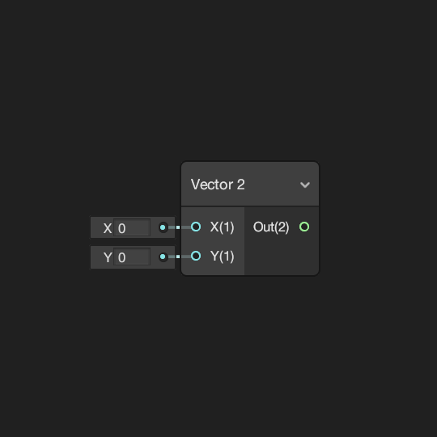|
|Defines a Float value in the shader.|Defines a Vector 2 value in the shader.|
|[**Vector 3**](Vector-3-Node.md)|[**Vector 4**](Vector-4-Node.md)|
|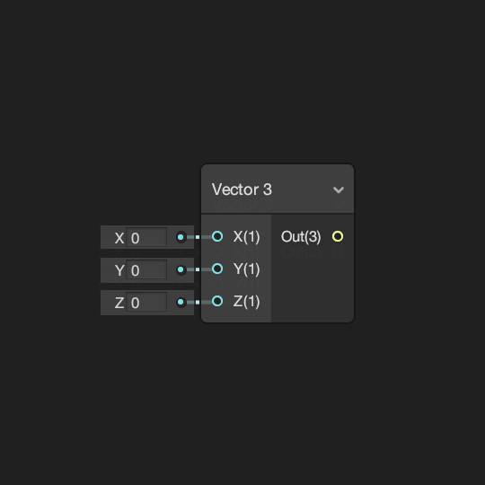|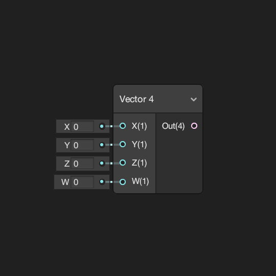|
|Defines a Vector 3 value in the shader.|Defines a Vector 4 value in the shader.|

## Geometry

|[Bitangent Vector](Bitangent-Vector-Node.md)|[Normal Vector](Normal-Vector-Node.md)|
|:--------:|:------:|
|[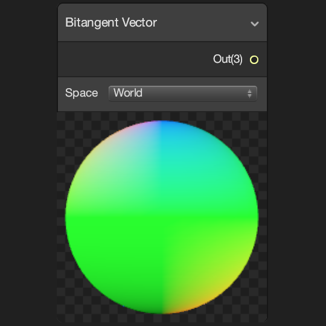](Combine-Node)|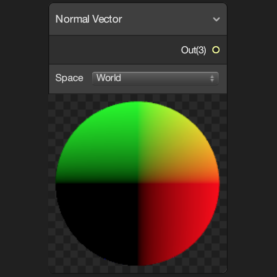|
| Provides access to the mesh vertex or fragment's Bitangent Vector. | Provides access to the mesh vertex or fragment's Normal Vector. |
|[**Position**](Position-Node.md)|[**Screen Position**](Screen-Position-Node.md)|
|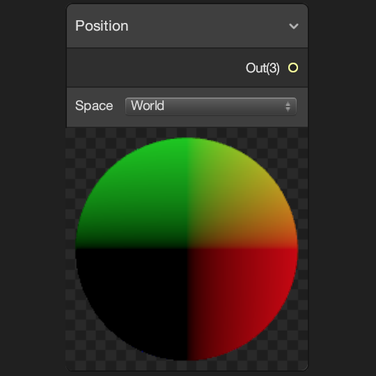||
|Provides access to the mesh vertex or fragment's Position.|Provides access to the mesh vertex or fragment's Screen Position.|
|[**Tangent Vector**](Tangent-Vector-Node.md)|[**UV**](UV-Node.md)|
|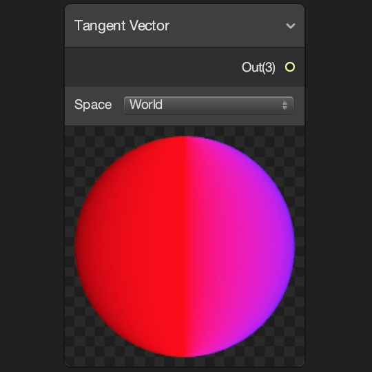||
|Provides access to the mesh vertex or fragment's Tangent Vector.|Provides access to the mesh vertex or fragment's UV coordinates.|
|[**Vertex Color**](Vertex-Color-Node.md)|[**View Direction**](View-Direction-Node.md)|
|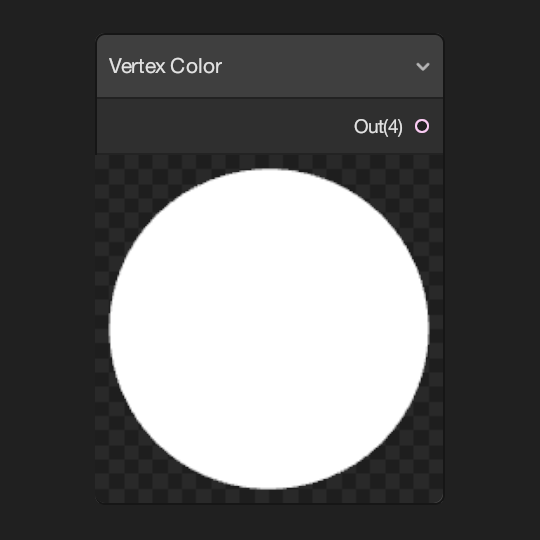|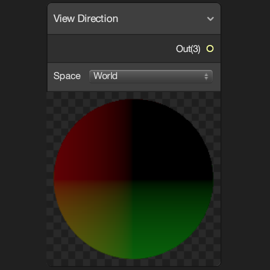|
|Provides access to the mesh vertex or fragment's Vertex Color value.|Provides access to the mesh vertex or fragment's View Direction vector.|

## Gradient

|[Blackbody](Blackbody-Node.md)|[Gradient](Gradient-Node.md)|
|:--------:|:------:|
||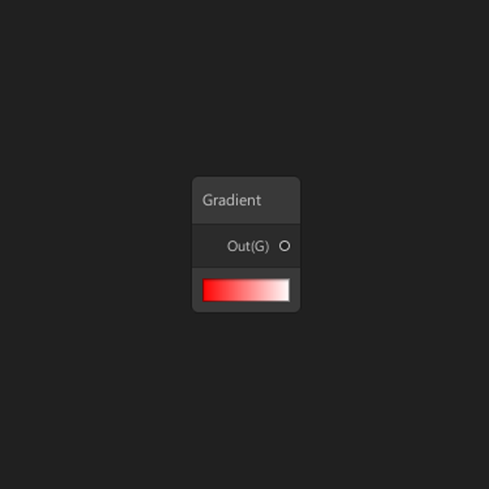|
| Samples a radiation based gradient from temperature input (in Kelvin).  | Defines a constant Gradient in the shader. |
|[Sample Gradient](Sample-Gradient-Node.md)|
||
| Samples a Gradient given the input of Time. |

## Matrix

|[Matrix 2x2](Matrix-2x2-Node.md)|[Matrix 3x3](Matrix-3x3-Node.md)|
|:--------:|:------:|
|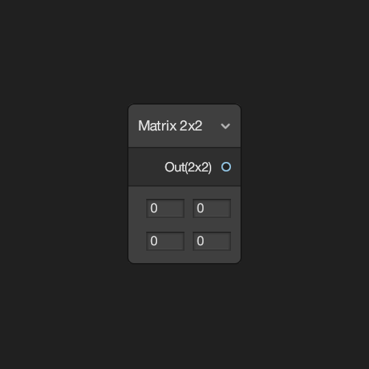|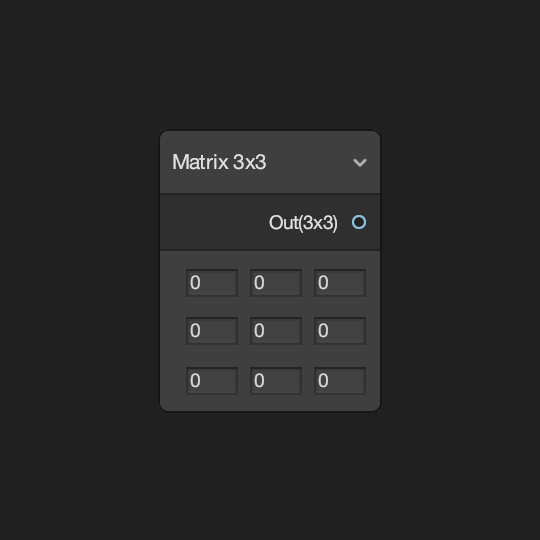|
| Defines a constant Matrix 2x2 value in the shader. | Defines a constant Matrix 3x3 value in the shader. |
|[**Matrix 4x4**](Matrix-4x4-Node.md)|[**Transformation Matrix**](Transformation-Matrix-Node.md)|
|||
|Defines a constant Matrix 4x4 value in the shader.|Defines a constant Matrix 4x4 value for a default Unity Transformation Matrix in the shader.|

## Mesh Deformation
| [Compute Deformation Node](Compute-Deformation-Node)         | [Linear Blend Skinning Node](Linear-Blend-Skinning-Node)     |
| :----------------------------------------------------------- | :----------------------------------------------------------- |
|              |             |
| Passes compute deformed vertex data to a vertex shader. Only works with the [DOTS Hybrid Renderer](https://docs.unity3d.com/Packages/com.unity.rendering.hybrid@latest/). | Applies Linear Blend Vertex Skinning. Only works with the [DOTS Hybrid Renderer](https://docs.unity3d.com/Packages/com.unity.rendering.hybrid@latest/). |

## PBR

|    [**Dielectric Specular**](Dielectric-Specular-Node.md)    |      [**Metal Reflectance**](Metal-Reflectance-Node.md)      |
| :----------------------------------------------------------: | :----------------------------------------------------------: |
|              |                     |
| Returns a Dielectric Specular F0 value for a physically based material. | Returns a Metal Reflectance value for a physically based material. |

## Scene

|[Ambient](Ambient-Node.md)|[Camera](Camera-Node.md)|
|:--------:|:------:|
|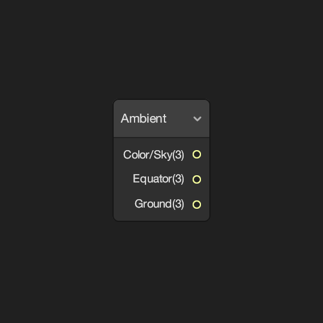||
| Provides access to the Scene's Ambient color values. | Provides access to various parameters of the current Camera. |
|[**Fog**](Fog-Node.md)|[**Baked GI**](Baked-GI-Node.md)|
|||
|Provides access to the Scene's Fog parameters.|Provides access to the Baked GI values at the vertex or fragment's position.|
|[**Object**](Object-Node.md)|[**Reflection Probe**](Reflection-Probe-Node.md)|
||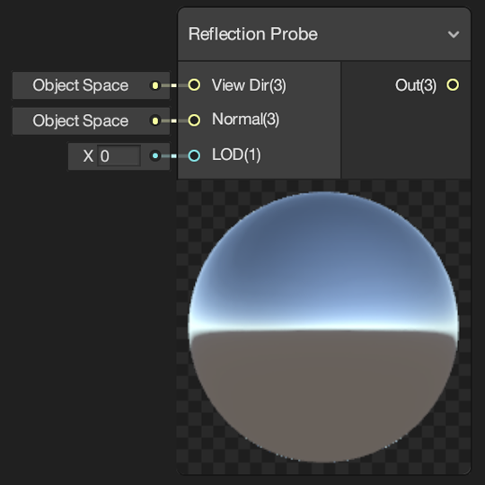|
|Provides access to various parameters of the Object.|Provides access to the nearest Reflection Probe to the object.|
|[**Scene Color**](Scene-Color-Node.md)|[**Scene Depth**](Scene-Depth-Node.md)|
|||
|Provides access to the current Camera's color buffer.|Provides access to the current Camera's depth buffer.|
|[**Screen**](Screen-Node.md)||
|||
|Provides access to parameters of the screen.||

## Texture

|[**Cubemap Asset**](Cubemap-Asset-Node.md)|[**Sample Cubemap**](Sample-Cubemap-Node.md)|
|:--------:|:------:|
|||
| Defines a constant Cubemap Asset for use in the shader. | Samples a Cubemap and returns a Vector 4 color value for use in the shader. |
|[**Sample Reflected Cubemap Node**](Sample-Reflected-Cubemap-Node.md)|[**Sample Texture 2D**](Sample-Texture-2D-Node.md)|
||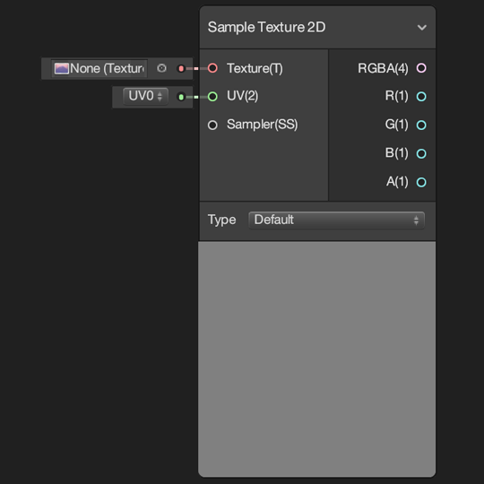|
|Samples a Cubemap with reflected vector and returns a Vector 4 color value for use in the shader.|Samples a Texture 2D and returns a color value for use in the shader.|
|[**Sample Texture 2D Array**](Sample-Texture-2D-Array-Node.md)|[**Sample Texture 2D LOD**](Sample-Texture-2D-LOD-Node.md)|
|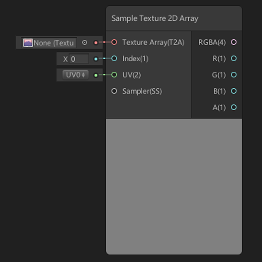||
|Samples a Texture 2D Array at an Index and returns a color value for use in the shader.|Samples a Texture 2D at a specific LOD and returns a color value for use in the shader.|
|[**Sample Texture 3D**](Sample-Texture-3D-Node.md)| [**Sample Virtual Texture**](Sample-Virtual-Texture-Node.md) |
||  |
|Samples a Texture 3D and returns a color value for use in the shader.| Samples a Virtual Texture and returns color values for use in the shader.|
|[**Sampler State**](Sampler-State-Node.md)|[**Texel Size**](Texel-Size-Node.md)|
||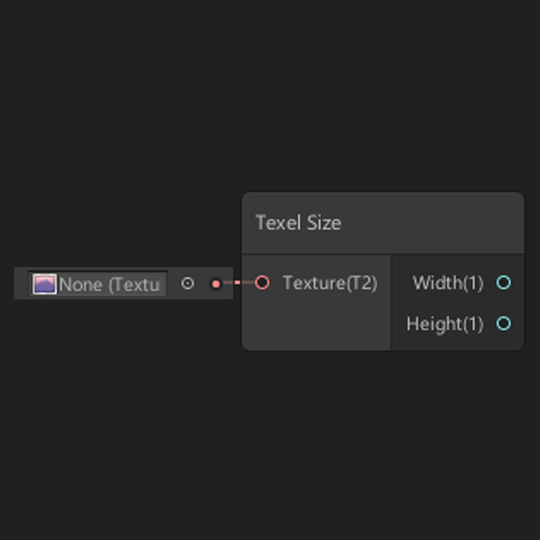|
|Defines a Sampler State for sampling textures.|Returns the Width and Height of the texel size of Texture 2D input.|
|[**Texture 2D Array Asset**](Texture-2D-Array-Asset-Node.md)|[**Texture 2D Asset**](Texture-2D-Asset-Node.md)|
|||
|Defines a constant Texture 2D Array Asset for use in the shader.|Defines a constant Texture 2D Asset for use in the shader.|
|[**Texture 3D Asset**](Texture-3D-Asset-Node.md)| |
|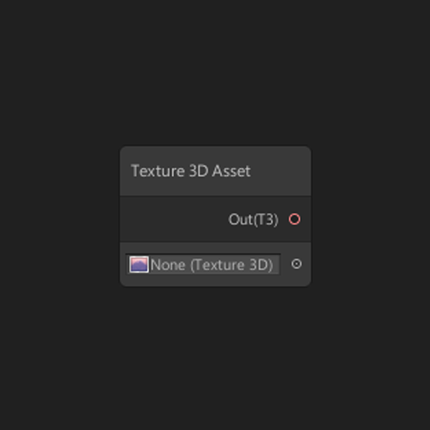| |
|Defines a constant Texture 3D Asset for use in the shader.| |
