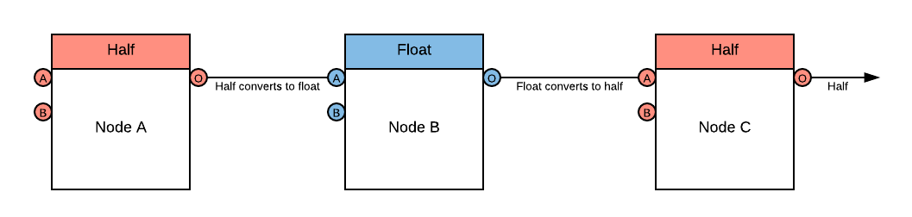
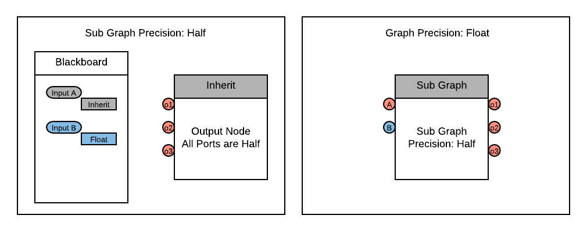

# Precision Modes

## Description

Shader Graph has the capability to set specific precision data modes for optimization across different platforms. The precision can be set for the whole graph using the Precision drop down in the top left hand corner, or set per-node on the graph in the gear menu on each node. 

See [Precision Types](Precision-Types.md) for type options. 

## Menu Options
| Name | Description |
|------:|------------|
| Float | Sets the precision mode to `float`. |
| Half | Sets the precision mode to `half`. |
| Inherit | Sets the precision mode to `inherit`.   See **Precision Inheritance** below. Only available on nodes. |

## Using Precision Modes
### Visualizing Precision
The precision of data through the graph can be visualized using the [Color Modes](Color-Modes.md) in the top right hand corner of the Shader Graph window. Setting the Color Mode to `Precision` will draw whether each node is using `half` or `float` at the current evaluation. 

### Graph Precision 
Using the drop down menu in the top left corner of the [Shader Graph Window](Shader-Graph-Window.md), the precision for the entire graph can be set to `float` or `half`. By default, new nodes created will use the precision set in this drop down menu.

### Node Precision 
Each node can set its own precision using the gear icon menu. The precision type will cast itself up or down as data flows through the graph based on the precision set on each node. 

For example, if a `half` node is connected to a `float` node, then the data will upcast to a `float`. If that `float` node is then connected to another `half` node, the data be downcast back to `half`. 

### Precision Inheritance
Nodes have a precision option called `inherit`. This means that they will inherit the precision mode of any incoming edges. All nodes use `inherit` mode by default when added to the graph. 
Nodes that do not have any edge connections to the input ports will use the **Graph Precision** when set to `inherit`. 

For example, **Node A** below is set to `inherit`. The graph is set to `half`, so the node will use `half` as its precision mode. 

Precision is read in the nodes for each input port. A node that is set to `inherit` can have two different precision modes connected to its input ports. The output preicsion mode in this case will be determined by the highest available precision mode based on the input ports. 

In the example below, **Node D** is set to `inherit`. **Node B** is passing in a precision of `half` via Input Port A. **Node C** is passing in a precision of `float` via Input Port B. **Node D** is going to output `float`, as that is the highest precision mode out of all input ports on **Node D**.

Nodes with no input ports can also be set with precision modes. These are typically Input Nodes, and by default they will be set to `inherit` and use the **Graph Precision**. The precision of the input data being fed into the graph can be manually set per node using the same method as any other node. 

Nodes set to `inherit` with no connected input ports will always use the **Graph Precision**. If the **Graph Precision** mode changes, the precision of those nodes will update to match the new precision. 

It's important to track which nodes are inheriting, as it is possible to create a conversion bottle neck when changing the **Graph Precision**.  

For example, if the **Graph Precision** is changed from `half` to `float`, but **Node B** has been manually set to `half`, the data flowing in to **Node B** will be converted from `float` to `half` and back to `float` again at **Node D**. 

### Sub Graph Precision 
When working with precision inside of [Sub Graphs](Sub-graph.md), the graph and node behavior will be the same as precision in normal graphs. **Graph Precision** is set using the same drop down in the top left corner. **Node Precision** per node inside of the sub graph is set on each node in the same gear icon menu. 

Precision for the **Sub Graph Output** is set on the **Output** node. This precision will apply to all output ports defined in the **Output** node of the sub graph. 

Precision for **Sub Graph Inputs** are set on the [Blackboard](Blackboard.md). Precision modes are set on each individual [Property](Property-Types.md). on the Blackboard of the sub graph. Properties that use the `inherit` option will inherit the precision set on the Sub Graph via the drop down menu in the top left corner. 

When using a [Sub-graph Node](Sub-graph-Node.md) inside of a main graph, the sub graph determines its own precision. Precision modes set on the input properties in the sub graph blackboard will inherit the **Sub Graph Precision** set on the sub graph asset. The output of the sub graph will use the precision set on the **Output** node. A [Sub-graph Node](Sub-graph-Node.md) cannot have its precision changed inside of a [Shader Graph](Shader-Graph.md). 

In the example below, the **Sub Graph Precision** is set to `half`. The **Graph Precision** is set to `float`. **Input A** and the **Output** node are both set to `inherit`. The input and output ports fo the sub graph will inherit `half` from the **Sub Graph Precision**, even though the **Graph Precision** is set to `float`. If you want the `inherit` behavior of the sub graph to match the graph, you would need to set the **Sub Graph Precision** to `float` as well. 

