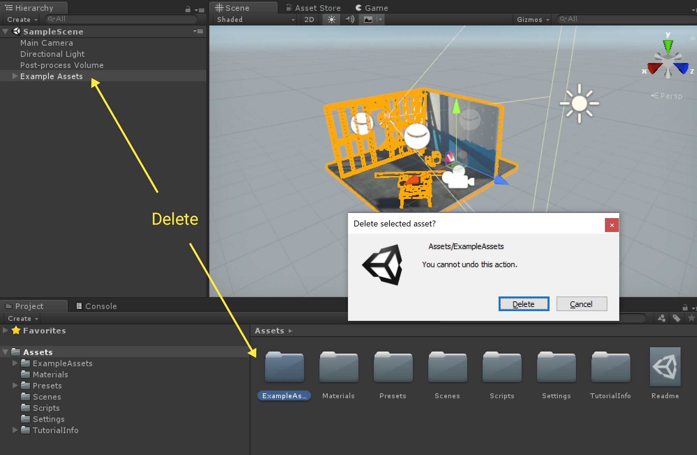
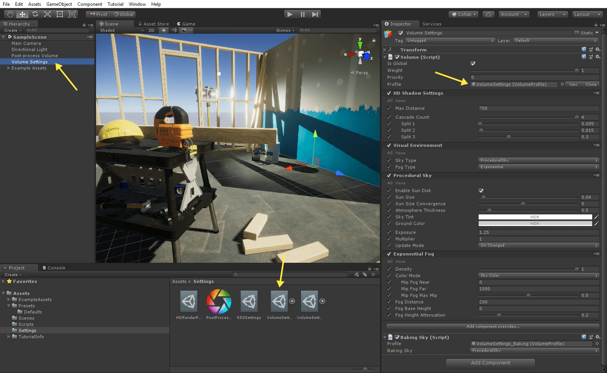

# _High Definition Project Template_ #

This template is a good starting point for people focused on high-end graphics that want to develop games for platforms that support Shader Model 5.0 (DX11 and above). 
This template utilizes the High Definition Render Pipeline, a modern rendering pipeline that includes advanced material types and a configurable hybrid tile/cluster deferred/forward lighting architecture.
This template also includes the new Shadergraph tool, Post-Processing stack, several Presets to jump start development, and example content. 

This Project Template uses the following features:

* High Definition Render Pipeline - For more information, see the <a href="https://github.com/Unity-Technologies/ScriptableRenderPipeline/wiki">wiki</a> on the Scriptable Render Pipeline repository.
* Shader Graph tool - This tool allows you to create shaders using a visual node editor instead of writing code. For more information on the Shader Graph, see the <a href="https://github.com/Unity-Technologies/ShaderGraph/wiki">wiki</a> on the Shader Graph repository.
* Post-processing stack - The Post-Processing Stack enables artists and designers to apply full -screen filters to scenes using an artist-friendly interface. For more information, see the <a href="https://github.com/Unity-Technologies/PostProcessing/wiki">wiki</a>  on the Post-Processing GitHub repository.

## Using the _High Definition Project Template_ ##

This Template utilizes the High Definition Render Pipeline.

The High-Definition Render Pipeline prioritizes stunning, high-fidelity visuals and is intended for high-end hardware: GPU-compute-capable consoles, and PC hardware (DX11 and above, Xbox One, PS4, Metal (macOS), 
and Vulkan (PC)).

Because this Template was created to deliver great visuals the render pipeline asset, project, lighting, and post-processing settings have been tuned with a high-end experience in mind. This makes it a great starting point 
for developers who want to make games with realistic, believable graphics that target high-end platforms and utilize the latest in rendering advancements.

This Template also includes default content intended to showcase how to set up lighting, materials, and post-processing for the best results with the high definition render pipeline. The content itself provides a good reference for how to lightmap your meshes 
(for meshes marked as Lightmap Static), place light probes, and author textures for use with the High Definition PBR material.

If you don’t want the example content in the scene you can easily delete it by deleting the ExampleAssets Object in the Hierarchy and ExampleAssets folder in the Project’s asset directory.

This will remove all the example content without breaking any Post-Processing or lighting settings. From here you can add your own meshes to this scene and have a well-lit asset without any additional work.

By default you will now find a script on the Camera that allows for simple WASD navigation through the scene and the speed of your movement is tunable via the camera inspector. 
This allows you to quickly navigate while in Play to inspect your geometry without having to write any C# code.

There are also a number of presets included in the scene and these have been tuned for use with the high definition render pipeline. 

The High-Definition Scriptable Render pipeline introduces a lot of new features, some of which you’ll see right away when exploring this Template. These include a new light editor with several additional light properties, 
new materials with new options (including several advanced material types such as subsurface and clear coat), volume-based scene settings (these control aspects of your projects such as your sky, fog, 
and shadow cascade settings), and a subsurface profile asset that includes examples for skin and foliage.

Some other new features accessible in this template include a large suite of new debug options, Layered Materials, Decals, and real-time Area Lights.

## Document revision history
|July 17, 2018|Initial Documentation Pass Added|
