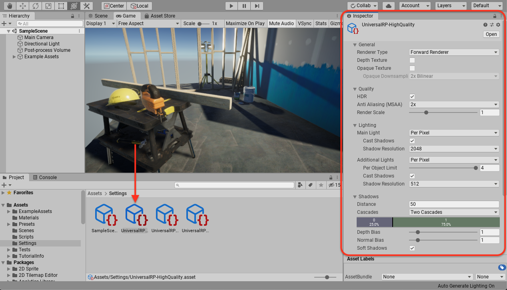

# About the _Universal Universal Render Pipeline Template_

The Universal Render Pipeline Template configures Project settings for Projects where performance, wide platform support, and ease of customizing graphics are the primary considerations.

This Template uses the following Unity features:

* Universal Render Pipeline (URP): a prebuilt Scriptable Render Pipeline that is quick and easy to customize, and lets you create optimized graphics across a wide range of platforms. URP also includes an optimized 2D renderer complete with 2D lights and pixel perfect rendering, and an integrated post-processing solution. For more information on URP, see the [URP documentation](https://docs.unity3d.com/Packages/com.unity.render-pipelines.universal@latest).
* Shader Graph: a tool that allows you to create shaders using a visual node editor instead of writing code. For more information on Shader Graph, see the [Shader Graph documentation](https://docs.unity3d.com/Packages/com.unity.shadergraph@latest).

The template contains the following:

* A sample Scene that contains examples of how to configure lighting settings, Materials, Shaders, and post-processing effects in URP 
* Several preconfigured [Universal Render Pipline Assets](https://docs.unity3d.com/Packages/com.unity.render-pipelines.universal@latest/index.html?subfolder=/manual/universalrp-asset.html) that let you quickly swap between graphics quality levels
* [Presets](https://docs.unity3d.com/Manual/Presets.html) that have been optimized for use with URP

## Using the Universal Project Template

### Using the sample Scene

The template contains a Scene named _SampleScene_.  This Scene contains examples of lighting settings, Materials, Shaders, and post-processing effects in URP. The Scene also contains a script that lets you move the Camera around the Scene in Play Mode using the WASD keys.

You can use this Scene as a reference, or you can remove the example Assets from it and use it as a starting point for your own Project.

### Removing the example Assets from the Scene

You can easily remove the example Assets from the example Scene, while keeping the lighting and post-processing settings. This allows you to add your own meshes to the Scene, and quickly have a well-lit Scene without any additional work.

1. In the Hierarchy window, right click the **ExampleAssets** Prefab
2. Click **Delete**

### Removing the example Assets from your Project

If you want to completely remove the example Assets from your Project, it is easy to do so.

1. In the Project window, open the **Assets** folder
2. Right click the **ExampleAssets** folder
2. Click **Delete**
3. In the pop-up that appears, click **Delete**

## Using the Universal Render Pipeline Assets

URP allows you to configure many of its rendering settings, including settings relating to quality, lighting, shadows and post-processing, in a single place. This is the Universal Render Pipeline Asset.

This template contains several preconfigured Universal Render Pipeline Assets, each optimized for a different tier of hardware. You can use these preconfigured Universal Render Pipeline Assets as a reference for creating your own Universal Render Pipeline Assets, or you use them in your own Project without any need for further customization.

For more information on Universal Render Pipline Assets, see the [Universal Render Pipline Assets documentation](https://docs.unity3d.com/Packages/com.unity.render-pipelines.universal@latest/index.html?subfolder=/manual/universalrp-asset.html).

To change the Universal Render Pipeline Asset that the Project is using:

1. In the Project window, navigate to the folder named **Settings**
2. Open the Graphics Settings window (**Edit** > **Project Settings** > **Graphics**)
3. Locate the **Scriptable Render Pipeline Settings** field 
3. Drag a Universal Render Pipeline Asset from the **Settings** folder in the Project window on to the **Scriptable Render Pipeline Settings** field

## Document revision history
|November 25, 2019|Complete revision.|
