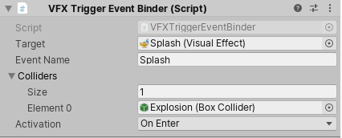

<b>Draft:</b> The content on this page is complete, but it has not been reviewed yet.

<b>Experimental:</b> This Feature is currently experimental and is subject to change in later major versions.

# Event Binders

Event Binders is a set of **MonoBehaviour** Scripts that help sending [Events](Events.md) to [Visual Effects](VisualEffectComponent.md) when a particular event happens in the scene. Event binders can also attach [Event Attribute Payloads](Events.md#eventattribute-payloads) to the events that are sent.

## Mouse Event Binder

The Mouse Event Binder sends an event to a Visual Effect based on actions taken with the Mouse (Click, Hovering, Dragging)

**Requires:** Collider

**Properties:**

* Target (Visual Effect) : The Visual Effect instance to send the event to.
* Event Name (string) : The name of the event to send
* Activation (enum) : Describes when the event should occur
  * OnMouseDown : When the collider is clicked, after clicking
  * OnMouseUp : When the collider is clicked, after releasing the click
  * OnMouseEnter : When the cursor enters the collider's on-screen area
  * OnMouseExit : When the cursor exits the collider's on-screen area
  * OnMouseOver : When the cursor hovers the collider's on-screen area
  * OnMouseDrag : When the mouse is dragged over the collider's on-screen area

* Raycast Mouse Position (bool) : will use a `position ` EventAttribute as the result of a raycast towards the collider.

## Rigid Body Collision Event Binder

The Rigid Body Collision Event Binder sends an event to the target Visual Effect every time the Rigid Body recieves a collision. This binder will also attach the collision world position to the `position` EventAttribute, and the contact Normal to the `velocity ` EventAttribute.

**Requires:** RigidBody & Collider

**Properties:**

- Target (Visual Effect) : The Visual Effect instance to send the event to.
- Event Name (string) : The name of the event to send

## Trigger Event Binder

The Trigger Event Binder sends an event to the target Visual Effect every time a collider from a list interacts with the currently set trigger. This binder will also attach the world position of the Collider instigator to the `position` EventAttribute.

**Requires:** Collider with Trigger flag set to ` true` 

**Properties:**

- Target (Visual Effect) : The Visual Effect instance to send the event to.
- Event Name (string) : The name of the event to send
- Colliders (List\<Collider\>) : A list of colliders to use with this trigger.
- Activation (enum) : The event to use to trigger the event.
  - OnEnter: When any Collider enters the trigger
  - OnExit: When any Collider exits the trigger.
  - OnStay: When any Collider stays in the trigger.

## Visibility Event Binder

The Trigger Event Binder sends an event to the target Visual Effect every time the renderer attached to this game object becomes visible or invisible.

**Requires:** A Renderer Component

**Properties:**

- Target (Visual Effect) : The Visual Effect instance to send the event to.

- Event Name (string) : The name of the event to send

- Activation (enum) : The event to use to trigger the event.

  - OnBecameVisible: When the renderer was not visible then becomes visible.

  - OnBecameInvisible:  When the renderer was visible then becomes not visible.

    