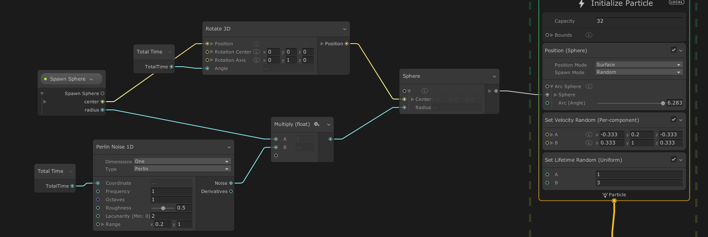

<b>Draft:</b> The content on this page is complete, but it has not been reviewed yet.

# Operators

Operators are the atomic elements of the [Property Workflow](GraphLogicAndPhilosophy.md#property-workflow-horizontal-logic) : these Nodes enable defining custom expressions in Visual Effect Graphs in order to create custom behaviors in the graph, for instance compute values from math operations and use the result of these operations to sample curves, gradients, to use the resulting values into [Block](Blocks.md) or [Context](Contexts.md) input [Properties](Properties.md).

## Adding Operator Nodes

You can add operator Nodes:

* Using the Create Node Menu:
  * By right-clicking in an empty space and selecting **Create Node** from the menu
  * By pressing the Spacebar key with the cursor in an empty space.
  * By making an Edge Connection from a Property, then releasing the click in an empty space.
* By duplicating Nodes:
  * Using **Duplicate** from Context menu (or Ctrl+D)
  * Using **Copy**, **Cut** and **Paste** from Context menu (or Ctrl+C/Ctrl+X then Ctrl+V)

## Configuring Operators

Adjusting Operator [Settings](GraphLogicAndPhilosophy.md#settings) in the Node UI or the Inspector can change the way the Operator looks and behaves.

> For instance, Changing the Cull Mode of a `Position (Depth)` Operator  from *None* to *Range* will add an extra *Depth Range* property to the Operator.

## Uniform Operators

Some operators can be used with **single input of Variable Type** : for instance Absolute values can be used for a float, a Vector3 or an Integer. These Nodes are called **Uniform Operators**.

The output type of any uniform Operator will always be the same as its input Type. Connecting a new input with a different type will change automatically the output type of the operator. If you want to manually set the Node to a specific type, see the next paragraph.

##### Configuring Uniform Operators

Pressing the Options icon in the top-right corner switches the Node view to Configuration mode : in this mode you can manually change the operator Type.

## Unified Operators

In addition to the uniform operators, some operators with many inputs can handle **multiple inputs of Variable Types** : These Nodes are called **Unified Operators**.

> For instance the **Lerp** operator can interpolate between Two Vectors uniformly based on a float or every component using a Vector of the Same Length.

Unified Operators come with type constraints but allow some flexibility in order to adapt to some variety of types.

#### Configuring Unified Operators

Pressing the Options icon in the top-right corner switches the Node view to Configuration mode : in this mode you can manually change the operator Types for every input. In some cases, changing one input type will change another input type as well, in order to maintain compatibility.

## Cascaded Operators

Some operators can be used to process a variable input count : these are called **Cascaded Operators**. In addition to the ability of processing many outputs, they also can handle different input Types, like **Unified Operators**

> For instance, the Add Node enables addition of many inputs of different types, using a single Node.

You can connect many inputs to a cascaded operator: to add a new item to the list, connect an edge to the last gray input at the bottom of the Node : a new input will be created, using the property type you connected.

Deleting a connection will remove the input property from the list as well. However you can delete manually an input property using the Configuration Mode (see next paragraph).

#### Configuring Cascaded Operators

Pressing the Options icon in the top-right corner switches the Node view to Configuration mode : in this mode you can:

* Rename Inputs using their Text Field
* Change Input Types using the type Popup
* Reorder Inputs by dragging the Handle on the left of each input line
* Manually Add Inputs using the + button
* Delete Selected Input using the - button
