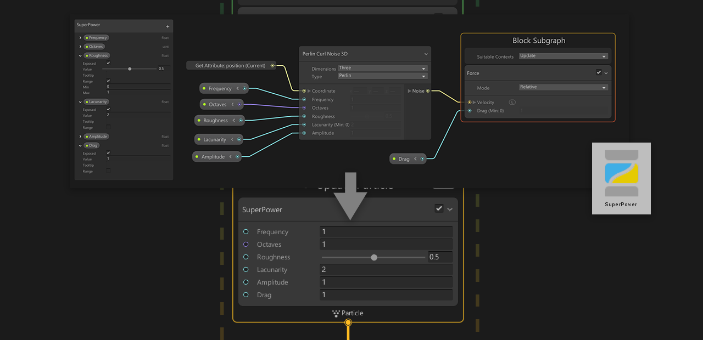

<b>Draft:</b> The content on this page is complete, but it has not been reviewed yet.

# Subgraph

A Visual Effect Subgraph is an Asset that contains a part of a Visual Effect Graph that can be used in another Visual Effect Graph or Subgraph. Subgraphs appear as a single Node.

Subgraphs can be used in graphs as three main usages:

* **System Subgraph** :  One, or many [Systems](Systems.md) contained into one Graph
* **Block Subgraph** : A set of [Blocks](Blocks.md) and [Operators](Operators.md) packaged together and used as a Block
* **Operator Subgraph** : A set of [Operators](Operators.md) packaged together and used as an Operator.

Subgraphs enable factorizing commonly used sets of Nodes in a graph into reusable Assets and adds them to the Library.

## System Subgraphs

System Subgraphs are Visual Effect Graphs that are **nested** inside other Visual Effect Graphs.

Visual Effect Graphs used as Subgraphs appear as a [Context](Contexts.md) that presents:

* **Exposed Properties** defined in the subgraph
* **Events** used in the subgraph.

### Creating System Subgraphs

You can create a System Subgraph using the following:

* Creating a Visual Effect Graph in the Project Window
* Selecting one or Many Systems in a Visual Effect Graph, then selecting "Convert to Subgraph" in the Right-Click context menu, then saving the Graph Asset in the Save File Dialog.
  * Creating a subgraph using this method will replace all converted content with a System Subgraph Node.

### Editing Block Subgraphs

You can edit a System Subgraph by opening it in the Visual Effect Graph window:

- By double clicking the Visual Effect Graph Asset in the Project view
- By right-clicking the System Subgraph Context and selecting Enter Subgraph in the context menu.

### Using a System Subgraph in a Visual Effect Graph

You can add a System Subgraph Node to your Graph by dragging a Visual Effect Graph from your Project View to the Visual Effect Graph window.

### Customizing System Subgraph Nodes

You can customize properties just like they would be on a Visual Effect Graph Component, but you can also use Operators to create custom expressions in order to extend the behavior of the systems used as subgraph.

Events Can be sent using Event or Spawn Contexts to the Workflow inputs of the System Subgraph Node.

## Block Subgraphs

Block Subgraphs are specific Subgraphs that only contain Operators and Blocks and that can be used as Blocks inside another Visual Effect Graph or SubGraph.

### Creating Block Subgraphs

You can create a Block Subgraph using the following:

- Creating a Visual Effect Subgraph Block in the Project Window
  - Using the Menu `Asset/Create/Visual Effects/Visual Effect Subgraph Block`
- Selecting one or Many Blocks and optionally operators in a Visual Effect Graph, then selecting "Convert to Subgraph Block" in the Right-Click context menu, then saving the Sub Graph Asset in the Save File Dialog.
  - Creating a subgraph using this method will replace all converted content with a Block Subgraph Node.

### Editing Block Subgraphs

You can edit a Block Subgraph by opening it in the Visual Effect Graph window:

* By double clicking the Subgraph Asset in the Project view
* By right-clicking the subgraph Block and selecting Enter Subgraph in the context menu.

Block Subgraphs display a non-removable Context named "Block Subgraph" where Blocks can be added.

* All Blocks present in the context will be executed in their order when used as a subgraph
* Context can be customized using the following Properties:
  * **Suitable Contexts** : Determine Which Context types are compatible with the Block Subgraph

### Using Block Subgraphs

You can add a Block Subgraph Node to your Graph:

*  By dragging a Visual Effect Subgraph Block Asset from your Project View to the Visual Effect Graph window, inside a Context's Block Area.
* Using the Add Block Menu, by typing the Block Subgraph Asset name.

### Customizing Block Subgraphs

You can customize properties just like they would be on a regular Block, but you can also use Operators to create custom expressions in order to extend the behavior of the Block used as subgraph.

## Operator Subgraphs

Operator Subgraphs are specific Subgraphs Assets that only contain Operators and that can be used as Operators inside another Visual Effect Graph or Sub Graph.

### Creating Operator Subgraphs

You can create an Operator Subgraph using the following:

- Creating a Visual Effect Subgraph Operator in the Project Window
  - Using the Menu `Asset/Create/Visual Effects/Visual Effect Subgraph Operator`
- Selecting one or Many Operator and optionally operators in a Visual Effect Graph, then selecting "Convert to Subgraph Operator" in the Right-Click context menu, then saving the Sub Graph Asset in the Save File Dialog.
  - Creating a subgraph using this method will replace all converted content with an Operator Subgraph Node.

### Editing Operator Subgraphs

You can edit an Operator Subgraph by opening it in the Visual Effect Graph window:

- By double clicking the Subgraph Asset in the Project view
- By right-clicking the subgraph Block and selecting Enter Subgraph in the context menu.

You can set up Input and Output Properties for the Operator using the Blackboard Window:

* You can create **Input** Properties by adding new Properties and enabling their **Exposed** Flag.
* You can create **Output** Properties by adding new Properties, and moving them to the **Output Category**.

### Using Operator Subgraphs

You can add an Operator Subgraph Node to your Graph:

- By dragging a Visual Effect Subgraph Block Asset from your Project View to the Visual Effect Graph window, inside a Context's Block Area.
- Using the Add Block Menu, by typing the Block Subgraph Asset name.

### Customizing Operator Subgraphs

You can customize properties just like they would be on a regular Block, but you can also use Operators to create custom expressions in order to extend the behavior of the Block used as subgraph.
