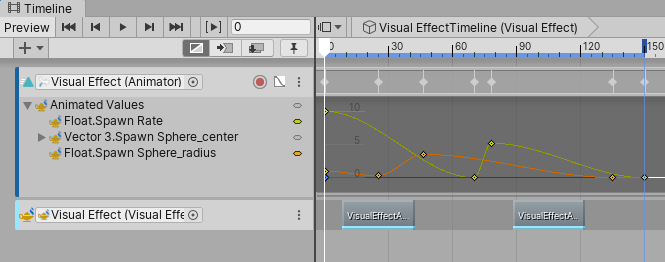
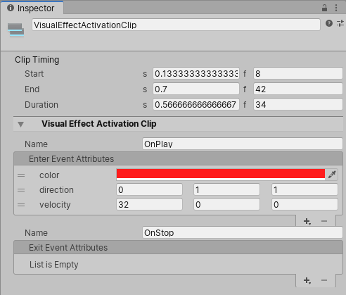
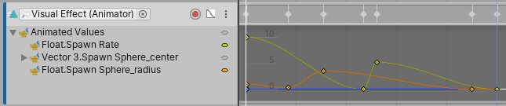
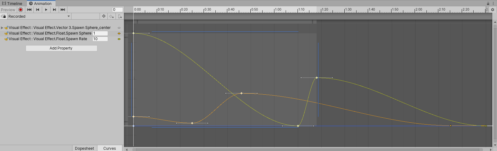

<b>Draft:</b> The content on this page is complete, but it has not been reviewed yet.

# Using Visual Effects with Timeline

Visual Effects can be sequenced using Timeline. The Properties and Event interfaces have full access over Timeline's Animation Tracks to animate [Exposed Properties](Blackboard.md) and a new Visual Effect Activation Track that sends [Events](Events.md) and EventAttribute Payloads.

## Visual Effect Activation

You can Send Events to Visual Effects in Timeline by using a VisualEffect Acitvation Track and adding Visual Effect Activation Clips to the Track. Every clip is in charge of sending two events, at the beginning and at the end of the clip. Every event can be configured to send an Attribute Payload.

#### Visual Effect Activation Tracks

To create a Visual Effect Activation Track, drag and drop a GameObject that contains a Visual Effect to your current timeline, then Select **Visual Effect Activation Track** from the Context Menu.

#### Visual Effect Activation Clips

Once the track is created, you can add **Visual Effect Activation Clips** to the track by right clicking the track workspace, then select Add Visual Effect Activation Clip from the Context Menu.

Selecting the Clip will display its properties in Inspector:

On Enter Event:

* Name : (Default OnPlay) The name of the Event to Send when entering the clip.
* Enter Event Attributes : A list of attributes to send with the Enter Event.

On Exit Event:

- Name : (Default OnStop) The name of the Event to Send when exiting the clip.
- Exit Event Attributes : A list of attributes to send with the Exit Event.

## Animating Properties

Animating Visual Effect Exposed Properties in Timeline (and Animation Window) is pretty straightforward and uses the same workflow as animating Game Object Properties.

### In Timeline

Using a Timeline Animation Track, you can animate Exposed Properties the same way you would animate Game Object properties.

### In Animation Window

In addition to the Timeline View, Properties can be animated in the Animation Window, like other Game Object Properties.

In addition to Numeric Values, you can also change Textures during the animaion.
