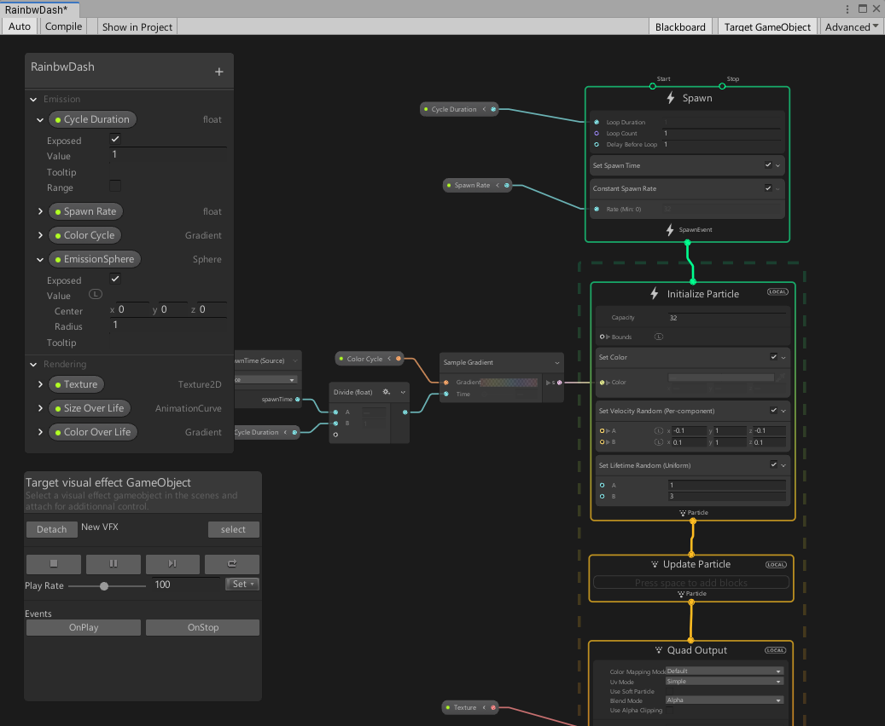

# The Visual Effect Graph window

The Visual Effect Graph window is the main window for Visual Effect Graph. This is where you can edit Visual Effect Graph Assets, and Subgraph Assets. The window displays a workspace that consists of the Systems, Contexts, and Operators that a  [Visual Effect Graph Asset](VisualEffectGraphAsset.md) contains.

## Opening the Visual Effect Graph window

To open the Visual Effect Graph window, you can use any of the following methods:

* In the Project window, double-Click a [Visual Effect Graph](VisualEffectGraphAsset.md) Asset or [SubGraph](Subgraph.md) Asset. You can also click the **Open** button in the Inspector for the respective Asset. This connects the Asset that you open to the window.
* In the Inspector for a [Visual Effect component](VisualEffectComponent.md#the-visual-effect-inspector), click the **Edit** button next to the **Asset Template** property. This connects the Asset assigned to **Asset Template** to the window.
* In the menu, select **Window > Visual Effects > Visual Effect Graph**. This opens an empty Visual Effect Graph window so you need to open a Visual Effect Graph Asset to use the editor.

## The Visual Effect Graph window layout

Inside the Visual Effect Graph window, there are multiple zones and panels.

* **[Toolbar](#Toolbar)** (Red) : This bar contains controls that affect the Visual Effect Graph globally. This includes controls that specify when Unity compiles the Visual Effect Graph as well as controls that let you display/hide certain panels.
* **[Node Workspace](#NodeWorkspace)** (Green) : This is where you can view and edit the Visual Effect Graph.
* **[Blackboard](#Blackboard)** (Blue) : This panel displays the properties that the Visual Effect Graph uses.
* **[Target Visual Effect GameObject](#TargetGameObject)** (Purple) : This panel displays controls for the GameObject currently attached.

### Toolbar

The Visual Effect Graph window Toolbar contains functionality to operate on a Visual Effect Graph Asset.

| Item                  | Description                                                  |
| --------------------- | ------------------------------------------------------------ |
| **Auto**              | **Toggle** : Toggles Auto-compilation of the Visual Effect Graph. |
| **Compile**           | **Action** : Recompiles the currently opened Visual Effect Graph. |
| **Show in Project**   | **Action** : Focuses the currently opened Visual Effect Graph's Asset in the Project window. |
| **Blackboard**        | **Toggle** : Toggles visibility of the **Blackboard Panel**. |
| **Target GameObject** | **Toggle** : Toggles visibility of the **Target VisualEffect GameObject Panel**. |
| **Advanced**          | **Menu:** Displays Advanced Properties. The options are  &#8226; **Runtime Mode (Forced)**: Forces optimized compilation, even when the editor is open. &#8226; **Shader Validation (Forced)**: Performs a forced Shader compilation when the effect recompiles, even if no visual effect is visible. This displays the Shader errors in the Scene.  &#8226; **Refresh UI**: Refreshes the window UI. |

### Node Workspace

The Node workspace is the area below the toolbar. Here you can navigate around and edit the graph. The Node workspace also holds the **Blackboard** and **Target VisualEffect GameObject** panels.

### Blackboard

The **Blackboard** is a panel that allows you to manage properties that the Visual Effect Graph uses. It is a floating panel that is independent of the zoom and position of the current Workspace view. The window always displays this panel on top of Nodes in the **Node Workspace**.

To resize this panel, click on any edge or corner and drag. To reposition this panel, click on the header of the panel and drag.

For more information, see [Blackboard](Blackboard.md).

### Target Visual Effect GameObject

The **Target Visual Effect GameObject** panel allows you to attach the currently opened Visual Effect Graph to a GameObject and control playback options as well as trigger Events. It is a floating panel that is independent of the zoom and position of the current Workspace view. The window always displays this panel on top of Nodes in the **Node Workspace**.

To resize this panel, click on any edge or corner and drag. To reposition this panel, click on the header of the panel and drag.

## Using the Node Workspace

### Navigating the Workspace

The navigation controls for the Node Workspace are similar to those that other graph-based Unity features use:

#### Move around the graph:

* Click the Middle Mouse button and drag.
* Hold the **Alt** key, left click and drag.

#### Zoom in and out using :

* To zoom in, scroll the Mouse Wheel up.
* To zoom out, scroll the Mouse Wheel down.

#### Select elements:

* To select elements individually, click on them.
  * To add to/remove an element from the current selection, hold the **Ctrl** key and click on it.
* To create a selection rectangle, click in empty space and drag. This selects every element that the rectangle touches.
  * You can use a selection rectangle to add to/remove elements from the current selection. To do this, hold the **Ctrl** key and use the method described above to create a new selection rectangle.
* To create a selection marquee, hold the **Shift** key, click in empty space, and drag to create a path. This selects every element that the path/marquee touches.
* To clear the current selection, click in empty space.

#### Focus

*  To focus on a specific Node/group of Nodes, select the Node/Nodes and press the **F** key.
*  To focus on the entire graph, clear the current selection and press the **F** key.

#### Copy, Cut and Paste, and Duplicate elements:

* Right click on an element, or group of elements, to open a menu that displays relevant commands.
* Keyboard Shortcuts:
  * **Copy**: Ctrl+C.
  * **Cut**: Ctrl+X.
  * **Paste**: Ctrl+V.
  * **Duplicate**: Ctrl+D.
  * **Duplicate with edges**: Ctrl+Alt+D.

### Adding graph elements

To add graph elements, you can use any of the following methods:

* **Right Click Menu** : Right click to open the menu, select **Add Node**, then select the **Node** you want to add from the menu. This action is context-sensitive, based on the element that is below your cursor, and only provides you with graph elements that are compatible.
* **Spacebar Menu** : This shortcut is the equivalent of making a right-click, then selecting **Add Node**.
* Interactive Connections : When creating an edge from a port (either property or workflow), drag the edge around and release the click into empty space to display the Node Menu. This action is context-sensitive, based on the source port's type, and only provides you with compatible graph elements that you can connect to.

### Manipulating graph elements

You can manipulate graph elements in the workspace :

#### Moving elements

* To move an element around the workspace, left click on the element's header, drag the element to a new position, and release the mouse button.
* To move [Blocks](Blocks.md) inside a context, or move them to another context, click on the Block's header, drag the Block to a new position, and release the mouse button.

#### Resizing elements

Some elements, such as Sticky Notes, support resizing. To do this, click on any edge or corner, drag until you reach the desired element size, and release the mouse button.
